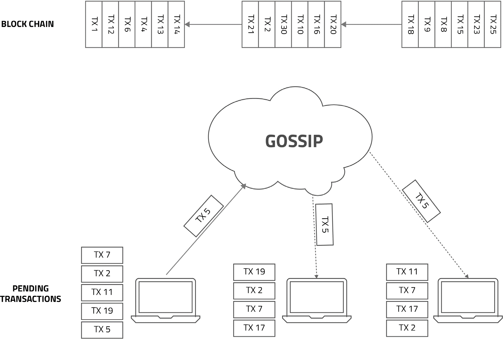

# Algorand 共识

了解 ArcBlock 如何利用尖端的 Algorand 共识算法，为其核心服务和应用程序实现高性能、强大的安全性和真正的去中心化。本节将详细介绍什么是 Algorand、其工作原理，以及它在 ArcBlock 生态系统中的具体应用。

## Algorand 简介

ArcBlock 是首批在生产环境中采用 Algorand 的区块链平台之一。Algorand 由密码学领域的杰出先驱、2012 年 ACM 图灵奖得主 Silvio Micali 开发，代表了共识协议设计的重大飞跃。Micali 的愿景是改进早期区块链模型的固有局限性，最终创造出一种安全、可扩展且去中心化的协议。

## Algorand 工作原理

Algorand 的共识机制基于纯粹权益证明（PPoS）协议，确保了去中心化网络所需的完全参与、保护和速度。其核心创新在于它如何选择节点来参与共识过程。

Algorand 不依赖于一组固定的验证者，而是使用可验证随机函数（VRF）秘密地、随机地选择一个小的节点委员会来提议和投票下一个区块。这个选择过程是密码学的，无法被对手预测或操纵。

下图说明了交易流程中的关键步骤：

```d2
direction: down

Transaction-Pool: {
  label: "交易池"
  shape: queue
}

Algorand-Network: {
  label: "Algorand PPoS 网络"
  shape: rectangle

  Proposal-Phase: {
    label: "1. 提议阶段"
    shape: rectangle

    Proposer: {
      label: "由 VRF 选出的单个用户\n提议区块"
      shape: c4-person
    }

    Proposed-Block: {
      label: "提议的区块"
      shape: rectangle
    }

    Proposer -> Proposed-Block: "创建"
  }

  Voting-Phase: {
    label: "2. 投票阶段"
    shape: rectangle

    Voting-Committee: {
      label: "由 VRF 选出的用户\n委员会进行投票"
    }
  }

  Certification-Phase: {
    label: "3. 认证阶段"
    shape: rectangle

    Certified-Block: {
      label: "已认证的区块"
    }
  }
}

Blockchain: {
  label: "区块链账本"
  shape: cylinder
}

Transaction-Pool -> Algorand-Network.Proposal-Phase.Proposer: "拉取交易"
Algorand-Network.Proposal-Phase.Proposed-Block -> Algorand-Network.Voting-Phase.Voting-Committee: "发送以供投票"
Algorand-Network.Voting-Phase.Voting-Committee -> Algorand-Network.Certification-Phase.Certified-Block: "获得足够票数后认证"
Algorand-Network.Certification-Phase.Certified-Block -> Blockchain: "附加到链上"
```

交易流程中的关键步骤如下：
1.  **提议：** 随机选择一个用户来提议下一个区块。这个选择是根据用户的权益加权的。
2.  **投票：** 接着随机选择一个更大的用户委员会对提议的区块进行投票。
3.  **认证：** 如果该区块获得足够多的票数，它就会被认证并添加到区块链中。整个过程在几秒钟内完成。

这种方法可以防止一小部分用户控制网络，并确保快速高效地达成共识。



## Algorand 在 ArcBlock 中的作用

ArcBlock 在几个关键领域集成了 Algorand 及其变体，以增强平台的性能和安全性。主要应用包括：

*   **智能合约执行：** Algorand 的共识机制被用来随机选择负责执行智能合约 Blocklet 的节点。这种去中心化的方法确保了执行是公平、防篡改的，并且不依赖于单一的中心化执行者。
*   **原生通证区块链：** 为 ArcBlock 原生通证服务提供动力的高性能区块链依赖 Algorand 作为其共识算法。这为安全高效地处理大量交易提供了所需的速度和可扩展性。

## 总结

通过采用 Algorand 共识算法，ArcBlock 构建了一个既高性能又安全的基础。这一战略选择使得平台能够为开发者和用户提供真正的去中心化体验，而无需在速度或可扩展性上做出妥协。ArcBlock 在智能合约执行和原生通证链等关键功能上实施 Algorand，彰显了其致力于利用先进、成熟的技术来构建下一代去中心化应用的承诺。随着项目接近其候选发布里程碑，更多实现细节将被披露。