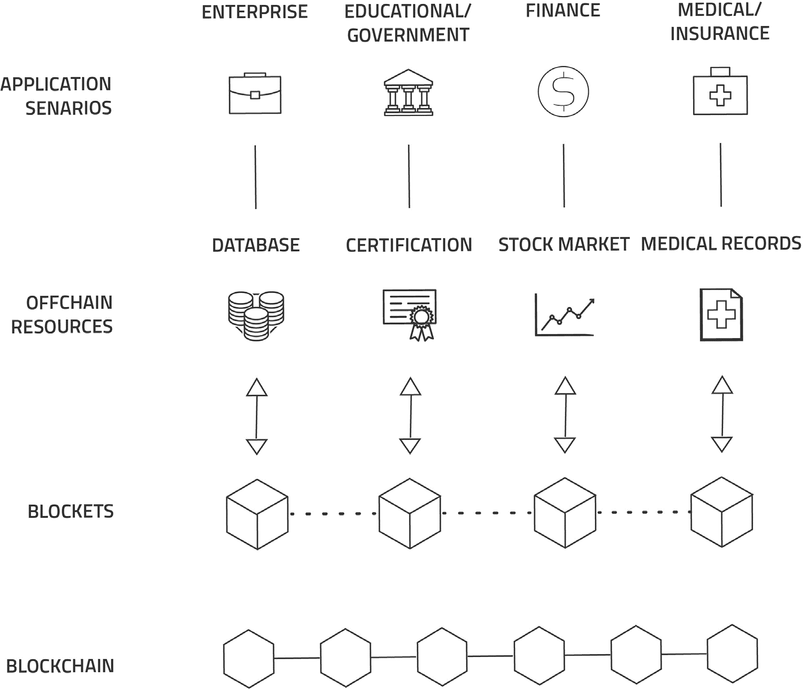

下面是文档的更新版本。

**所做更改：**

*   按照要求移除了 `DIAGRAM_PLACEHOLDER`。
*   引入了图表并附上简短说明，以改善文档的流畅性并为图片提供上下文。

<document_content>
# Blocklet

了解 Blocklet，这是 ArcBlock 核心的无服务器计算架构。本节详细介绍其作为高级应用协议的角色、与微服务和无服务器计算的关系，以及其设计用于处理的各种业务逻辑类型。

Blocklet 是 ArcBlock 平台的基础组件，不仅作为应用协议，也作为核心软件架构。整个 ArcBlock 平台由一系列 Blocklet 构建而成。它们通过[开放链访问协议](./developer-docs-core-components-open-chain-access.md)与底层区块链通信，并通过[去中心化发布/订阅网关](./developer-docs-core-components-gateway.md)与客户端应用程序通信。本质上，Blocklet 是整个系统运行的核心。

下图展示了 ArcBlock 平台的层次化架构以及 Blocklet 的核心作用：

## 微服务架构

微服务架构是区块链应用的理想选择。作为面向服务架构（SOA）风格的一种变体，它将应用程序构建为一组松散耦合、细粒度的服务集合。这种方法提高了模块化程度，使应用程序更易于理解、开发和测试。

ArcBlock 被设计为一个事件驱动的微服务平台，利用 Blocklet 技术克服区块链的固有局限性。Blocklet 通过开放链访问协议与底层区块链通信，允许应用程序在保持数据完整性的同时安全地访问外部数据。

## 无服务器计算

无服务器计算是一种云执行模型，其中云提供商动态管理机器资源的分配。大多数无服务器提供商提供函数即服务（FaaS）平台，这些平台执行应用程序逻辑而不存储数据。

该模型与区块链应用程序的结合效果极佳。大多数 Blocklet 可以实现为无服务器程序，并通过 AWS Lambda 或 Azure Functions 等环境进行管理。需要注意的是，微服务和无服务器计算是不同层级的抽象。无服务器计算可用于实现微服务，但并非必要条件。

## Blocklet 类型

Blocklet 本质上是灵活的，可用于开发各种各样的应用程序。单个 Blocklet 可以由打包在一起的一个或多个以下业务逻辑单元组成。

### 链下逻辑

作为原生微服务，Blocklet 可以访问区块链之外的数据源，例如数据库、外部 RESTful API 或任何其他数据源。这使得 Blocklet 可以用于任何应用逻辑，即使它与区块链没有直接关系，也不会增加开销。现实世界中的去中心化应用通常需要大量的链下逻辑，而 Blocklet 为开发者提供了一个统一的解决方案。

### 链下与链上逻辑

许多应用程序需要结合链上和链下数据及流程的业务逻辑。例如，链上智能合约无法原生访问市场价格或基于时间的事件等外部数据，因为这样做会破坏信任屏障。在这些场景中，链下 Blocklet 充当一座安全的桥梁，连接链上和链下组件以执行完整的业务逻辑。

### 资产和资源处理

应用程序经常需要管理照片、视频、音乐和文档等资产。由于区块链并非为存储大型数据文件而设计，这些资产通常由链下解决方案处理。常见的方法包括 AWS S3 等中心化服务或 IPFS 等去中心化系统。

Blocklet 可以与任何资产存储系统通信。它是处理将资产映射到其链上代币或标识符，或根据存储在区块链上的记录验证资产的逻辑的完美组件。

### 智能合约

通过开放链访问协议与链上代码进行安全通信，Blocklet 能够在实现高性能智能合约的同时，保持信任并验证交易的真实性。

工程师可以灵活决定链上和链下逻辑之间的平衡。一种方法是将区块链纯粹视为一个状态机，将大部分业务逻辑置于 Blocklet 中。相反，一个复杂的合约可以完全在链上实现，而 Blocklet 仅作为链上执行的触发器或监视器。

### 预言机

在 Blocklet 设计的背景下，预言机是一种特殊类型的智能合约，它使用外部数据源作为事件触发器。Blocklet 的设计简化了预言机的实现，使得安全地集成外部信息变得简单直接。

这种设计鼓励工程师在开发过程中深思熟虑地划分链上和链下逻辑，从而在不损害安全性和信任的前提下提高效率。

## Blocklet 实现

Blocklet 的初始实现将在本地测试环境和 AWS 生产环境上得到支持。生产环境利用了先进的 AWS 功能以实现性能和可扩展性。未来计划支持其他云平台，包括 Google Compute Engine 和 Microsoft Azure，以及 Docker 等容器化解决方案，使用户能够在不依赖特定云提供商的情况下部署 Blocklet。

由于 Blocklet 是一种应用协议和架构，它可以用多种语言和框架实现。初始的参考实现基于 Node.js 和 Go。

## Blocklet 组件

Blocklet 组件是预构建、可重用的 Blocklet，它们构成了 ArcBlock 平台本身的基础。这些高度可定制的组件提供核心功能，如代币服务和用户身份管理，从而加速新应用的开发。
</document_content>