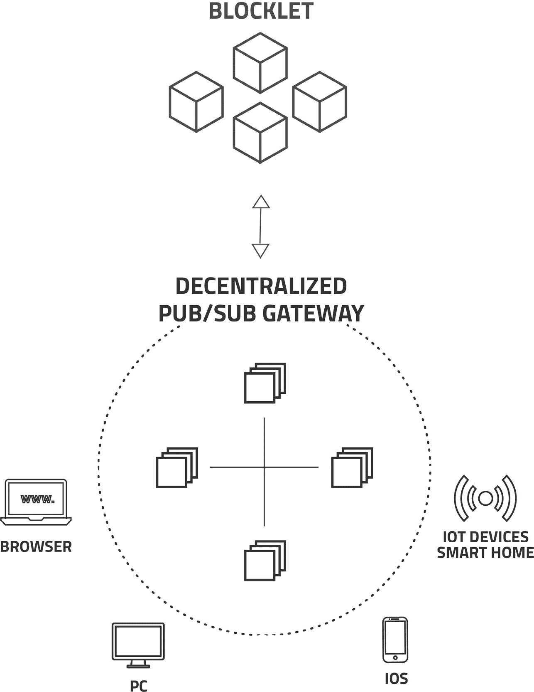
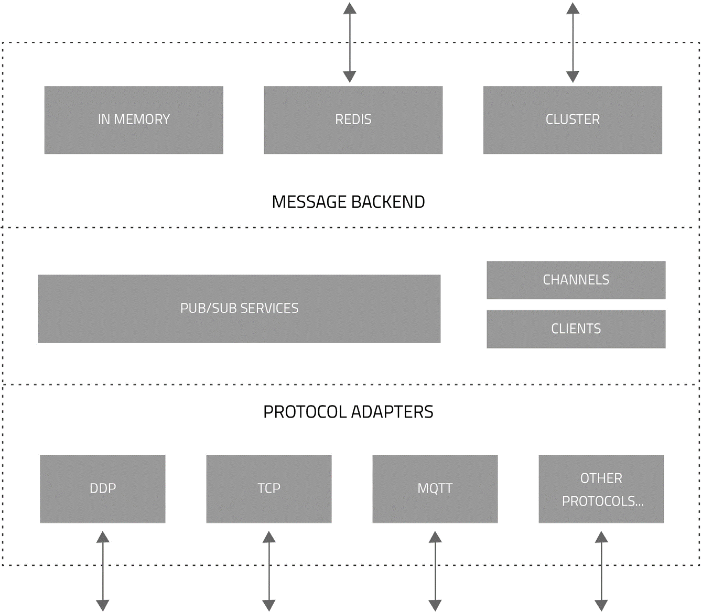
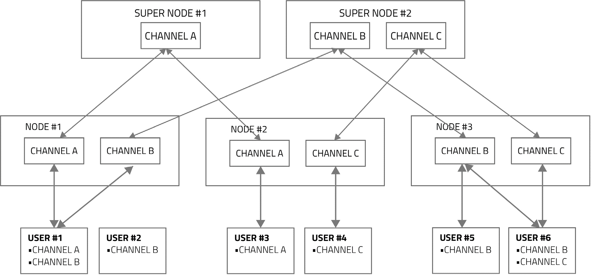

本文档提供了去中心化发布/订阅网关的技术概述，详细介绍了其作为 Blocklet 的分布式消息系统和 API 网关的角色。您将了解其架构、发布-订阅模式等核心功能，以及其去中心化、安全的设计原则。

# 去中心化发布/订阅网关

去中心化发布/订阅网关是一个分布式消息系统，旨在支持发布-订阅（Pub/Sub）消息传递，并作为 Blocklet 的中央 API 网关。该网关促进了客户端应用程序（在 Web 浏览器或移动设备上运行）与服务器端 Blocklet 组件之间的实时、响应式和安全通信。

## 微服务架构中的 API 网关

在微服务架构中，API 网关是所有客户端请求的关键入口点，它充当一个外观（façade），简化了对复杂底层系统的访问。客户端不直接与众多 Blocklet 通信，而是与 API 网关的单一、统一接口进行交互。这种方法将面向客户端的 API 与内部 Blocklet 实现解耦，提供了几个优势：

*   **简化的客户端交互：** 客户端只需与一个端点通信，无论应用程序的功能由多少个 Blocklet 提供。
*   **提高的灵活性：** 只要 API 合同保持不变，底层的微服务（Blocklet）就可以更新、重构或替换，而不会影响客户端应用程序。
*   **集中处理关注点：** 诸如身份验证、速率限制和协议转换等横切关注点可以在网关层面处理。

该网关专为协议的多样性而设计，开箱即支持多种常见的网络协议，包括 WebSocket、DDP、HTTPS 和 MQTT。这种灵活性允许开发者根据其需求选择最合适的通信方法。该系统也是可扩展的，允许集成新的网络协议。

## 发布-订阅（Pub/Sub）模式

该网关的功能建立在发布-订阅消息模式之上。这种模式将消息发送者（发布者）与消息接收者（订阅者）解耦，从而增强了可扩展性并创建了更动态的网络拓扑。

*   **发布者：** 将消息分类（通常称为“主题”或“频道”）的发送者，不直接了解订阅者。
*   **订阅者：** 对一类或多类消息表示兴趣并接收这些消息的接收者，不直接了解发布者。

该模型是面向消息的中间件系统的核心组件，特别适用于已发布数据结构通常定义良好的区块链应用程序。通过将发送者与接收者抽象分离，发布/订阅模式实现了一个高度可扩展和有弹性的通信层。

## 去中心化和安全设计

API 网关采用完全去中心化的架构实现，以简化部署并增强稳健性。关键设计特性包括：

*   **零配置：** 该网关设计为开箱即用。当一个新的网关节点启动时，它会自动发现其他节点并与它们协同工作。
*   **基于名称的寻址：** 服务通过命名系统进行定位，这抽象了具体的网络位置并促进了服务发现。
*   **自动集群和负载均衡：** 网关节点形成一个集群，自动分配流量和工作负载，以确保高可用性和性能。
*   **端到端加密：** 所有通过网关的网络流量都经过加密，确保了完全正向保密并保护传输中的数据。

这种去中心化的方法消除了单点故障，简化了云服务的管理，为基于 ArcBlock 构建的应用程序提供了有弹性和安全的通信骨干。

## 总结

去中心化发布/订阅网关是 ArcBlock 平台的基础组件。它结合了 API 网关的原则、发布-订阅消息模式和去中心化架构，创建了一个强大的实时通信层。该网关通过简化客户端与底层基于 Blocklet 的微服务之间的复杂交互，使开发者能够构建安全、可扩展且响应迅速的去中心化应用程序。

有关相关组件的更多信息，请参阅以下部分：
<x-cards data-columns="2">
  <x-card data-title="Blocklet" data-icon="lucide:box" data-href="/developer-docs/core-components/blocklet">
    了解用于运行应用程序逻辑的无服务器计算架构。
  </x-card>
  <x-card data-title="Open Chain Access" data-icon="lucide:link" data-href="/developer-docs/core-components/open-chain-access">
    理解用于访问各种底层区块链的协议。
  </x-card>
</x-cards>