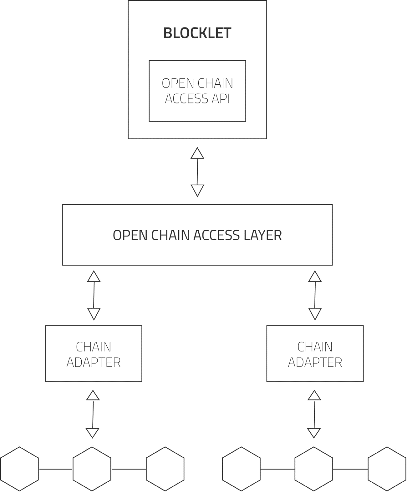

# 开放链访问协议

了解 ArcBlock 的开放链访问协议如何提供一个统一的抽象层，以构建能够与各种底层区块链无缝通信的应用程序。本节详细介绍该协议的架构、其多级 API 以及链适配器在实现区块链互操作性中的作用。

ArcBlock 的开放链访问协议是一个抽象层，使应用程序能够与各种区块链协议（如比特币、以太坊和 Hyperledger）协同工作。该协议被设计为开源的，允许社区贡献、创建扩展并推动改进。

其核心设计将应用程序逻辑与任何单一区块链的特定要求解耦。这是通过分层架构实现的，从而简化了开发，并确保应用程序具有适应性和面向未来的能力。

该架构概述如下：
```d2
direction: down

BLOCKLET: {
  label: "BLOCKLET"
  OPEN-CHAIN-ACCESS-API: {
    label: "开放链访问 API"
  }
}

OPEN-CHAIN-ACCESS-LAYER: {
  label: "开放链访问层"
}

CHAIN-ADAPTERS: {
  label: "链适配器"
  grid-columns: 3

  Bitcoin-Adapter: {
    label: "比特币适配器"
  }
  Ethereum-Adapter: {
    label: "以太坊适配器"
  }
  Hyperledger-Adapter: {
    label: "Hyperledger 适配器"
  }
}

Underlying-Chains: {
  label: "底层链"
  grid-columns: 3

  Bitcoin: {
    label: "比特币"
  }
  Ethereum: {
    label: "以太坊"
  }
  Hyperledger: {
    label: "Hyperledger"
  }
}

BLOCKLET.OPEN-CHAIN-ACCESS-API <-> OPEN-CHAIN-ACCESS-LAYER
OPEN-CHAIN-ACCESS-LAYER <-> CHAIN-ADAPTERS

CHAIN-ADAPTERS.Bitcoin-Adapter <-> Underlying-Chains.Bitcoin
CHAIN-ADAPTERS.Ethereum-Adapter <-> Underlying-Chains.Ethereum
CHAIN-ADAPTERS.Hyperledger-Adapter <-> Underlying-Chains.Hyperledger

Underlying-Chains.Bitcoin <-> Underlying-Chains.Ethereum
Underlying-Chains.Ethereum <-> Underlying-Chains.Hyperledger

```



## 开放链访问层

开放链访问层是定义了一套用于开放连接的高级通用 API 的核心组件。该层由底层的链适配器支持，每个适配器都是为特定的区块链协议实现的。它具有三个不同的 API 级别，以适应不同的开发需求。

| 级别 | 描述 |
| :---- | :---------- |
| **级别 1：通用链 API** | 提供开放链访问协议的基础 API 集。所有链适配器都必须支持此级别的每个 API。 |
| **级别 2：通用链数据 API** | 允许对区块链数据进行基本访问，将底层区块链视为一个有限状态机。虽然适配器必须支持此 API 级别，但它们的具体能力可能有所不同。该 API 集包含查询这些能力的方法。 |
| **级别 3：原生链 API** | 一个高级的可选 API 集，用于暴露底层区块链协议的原生功能。支持这些 API 可以让应用程序最大限度地利用特定区块链的独特功能。 |

## 链适配器

链适配器的功能类似于设备驱动程序，将底层区块链的特定协议转换为由开放链访问层定义的统一 API。这使得开发者可以与不同的区块链进行交互，而无需了解每一种区块链的复杂细节。一些适配器可能需要链上和链下组件的组合才能协同工作。

ArcBlock 将为包括比特币、以太坊和 Hyperledger 在内的主要区块链提供初始实现。由于该协议是开源的，社区将能够贡献新的适配器并改进现有的适配器。

### 链适配器市场

为了培育一个强大的生态系统，社区开发的链适配器将在 ArcBlock 市场上提供。当贡献者的适配器被使用时，他们将获得代币奖励，从而为社区开发各种高质量、高性能的适配器以支持不同的区块链创造了强大的激励。

## 与 BaaS 的关系

由 IBM 和 Microsoft Azure 等云服务提供商提供的区块链即服务 (BaaS) 平台，简化了区块链节点和网络的部署。ArcBlock 旨在与这些平台协同工作。

BaaS 简化了区块链基础设施的*部署*，而 ArcBlock 则简化了在该基础设施之上开发和*部署*去中心化应用程序的过程。ArcBlock 将与主要的云计算平台集成，允许用户直接在他们的 ArcBlock 应用程序中管理 BaaS 服务。

## 设计原则

开放链访问协议的设计深受传统数据库系统中开放数据库连接 (ODBC) 标准演变的启发。在许多应用程序架构中，区块链扮演着类似于数据库的角色。通过借鉴数据库发展的历史，ArcBlock 提供了一个标准化的、可互操作的访问层，它抽象了底层技术的复杂性，就像 ODBC 为数据库所做的那样。

这种方法使开发者能够专注于应用程序逻辑，而不是特定区块链的具体实现细节，从而实现更高效的开发和更具可移植性的应用程序。