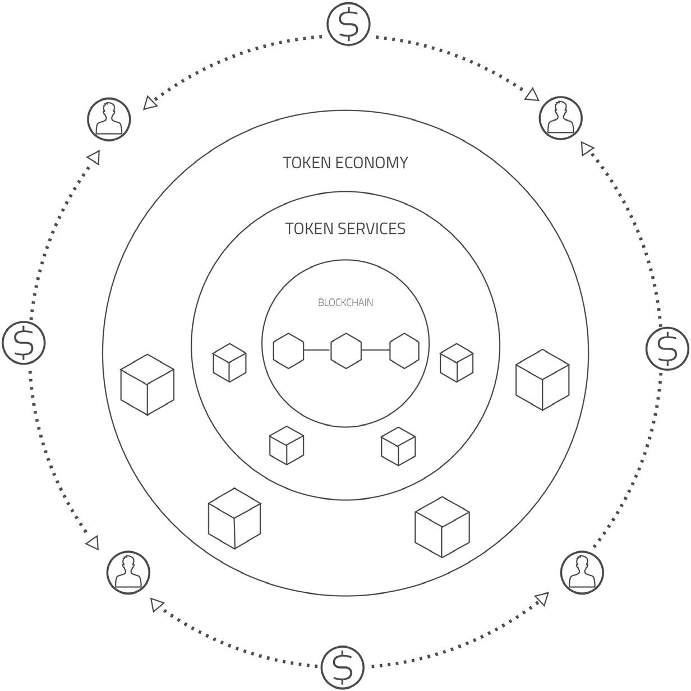

# 通证经济概念

了解 ArcBlock 自我维持生态系统的核心组成部分——ArcBlock 通证（ABT）、矿工和市场——并学习它们如何协同工作为平台提供动力。本节清晰、高层次地概述了确保网络稳健、去中心化和社区驱动的经济原则。

下图说明了 ArcBlock 通证经济中关键组件之间的关系：
```d2
direction: down

Developers-Users: {
  label: "开发者 / 用户"
  shape: c4-person
}

Miners: {
  label: "矿工"
  shape: c4-person
}

ArcBlock-Ecosystem: {
  label: "ArcBlock 生态系统"
  shape: rectangle

  ABT: {
    label: "ArcBlock 通证 (ABT)"
    shape: circle
    style.fill: "#f0ad4e"
  }

  Marketplace: {
    label: "市场"
    shape: rectangle
    style.fill: "#d9edf7"

    Reusable-Components: {
      label: "可复用组件"
      shape: rectangle
      grid-columns: 3

      Chain-Adapters: {
        label: "链适配器"
      }

      Blocklets: {
        label: "Blocklets"
      }

      Applications: {
        label: "应用程序"
      }
    }
  }

  Computing-Resources: {
    label: "计算资源"
    shape: rectangle
  }

  Foundation-Services: {
    label: "基础服务"
    shape: rectangle
  }

  Application-Tokens: {
    label: "应用通证"
    shape: circle
    style.fill: "#dff0d8"
  }
}

Developers-Users -> ArcBlock-Ecosystem.Marketplace: "发现并使用组件"
Developers-Users -> ArcBlock-Ecosystem.ABT: "支付服务费用"
Developers-Users -> ArcBlock-Ecosystem.Application-Tokens: "创建和使用"
Miners -> ArcBlock-Ecosystem.Computing-Resources: "提供资源"
Miners -> ArcBlock-Ecosystem.Marketplace.Reusable-Components: "贡献组件"
ArcBlock-Ecosystem.Marketplace -> Developers-Users: "提供组件"
ArcBlock-Ecosystem.ABT -> Miners: "补偿"
ArcBlock-Ecosystem.Foundation-Services -> ArcBlock-Ecosystem.ABT
ArcBlock-Ecosystem.Foundation-Services -> ArcBlock-Ecosystem.Marketplace
ArcBlock-Ecosystem.Foundation-Services -> ArcBlock-Ecosystem.Application-Tokens
```

## ArcBlock 通证 (ABT)

ArcBlock 通证 (ABT) 是 ArcBlock 平台的原生实用型通证，旨在为其生态系统提供动力。它作为平台内服务和资源的主要交换媒介。

为了支持广泛的应用，ArcBlock 专门为其通证服务开发了一条优化的区块链，旨在实现每秒超过 100,000 笔交易（Tx/s）的高性能目标。



ABT 的基本用途是支付使用 ArcBlock 系统的相关成本，类似于支付云计算服务的方式。然而，ArcBlock 通过让应用提供商能够代表其最终用户支付交易费来优化用户体验。这种模式简化了应用的使用，因为用户可以与应用程序交互，而无需直接管理交易费用。开发者可以按月结算成本，汇总小额费用以降低开支。

对于关键任务服务，开发者也可能需要质押一定数量的 ABT，以确保承诺和可靠性。为了促进流动性并与更广泛的区块链社区整合，ABT 与 ERC20 通证保持 1:1 的映射关系，使开发者能够利用成熟的以太坊生态系统。

## 矿工的角色

在 ArcBlock 生态系统中，“矿工”是为网络提供必要资源和组件的贡献者。与比特币等传统工作量证明系统中的矿工不同，ArcBlock 矿工贡献的是计算能力或软件组件，而不是解决加密难题。他们因其贡献而获得报酬，从而创建了一种增强平台实力的共生关系。

### 资源矿工

资源矿工是向 ArcBlock 网络提供计算资源的贡献者。这些资源可以通过多种方式提供：
*   **云计算：** 矿工可以使用来自云服务提供商的资源运行 ArcBlock 云节点。
*   **自托管：** 矿工可以贡献自己托管的计算基础设施。

矿工完全控制其资源的共享方式。他们可以将资源设为私有供自己使用，与特定群体共享，或向整个公共网络开放。

### 组件矿工

组件矿工为平台贡献可复用的软件。这些贡献对于扩展生态系统的能力和效率至关重要。组件的例子包括：
*   **链适配器：** 用于不同区块链的新连接器。
*   **Blocklet 组件：** 用于构建应用程序的可复用代码模块或服务。
*   **可直接部署的应用：** 其他用户可以部署的完整应用程序。

组件可以是打包的代码，也可以是通过 Blocklet 接口暴露的服务，例如专门的机器学习服务。智能合约管理多方开发的条款，定义如何分配费用以及他人如何分叉或修改组件的代码。

## ArcBlock 市场

ArcBlock 市场是构建在 ArcBlock 平台自身之上的去中心化应用程序。它是一个中心枢纽，用户可以在这里发现、评估和使用各种可复用组件。

**市场的主要功能：**
*   **上架与发现：** 组件矿工上架他们的链适配器、Blocklets 和应用程序，供他人查找。
*   **评估与声誉：** 市场维护公开的反馈、质量评级和开发者声誉。这些信息帮助用户在选择组件时做出明智的决定。
*   **透明与信任：** 所有市场数据都记录在 ArcBlock 的公共账本上，确保信息透明、不可篡改且值得信赖。

## 基础服务

平台的通证经济建立在一系列基础服务之上，这些服务本身也作为 Blocklets 实现。这种架构提供了灵活性，并允许社区贡献和改进核心通证服务。应用程序开发者可以使用这些 Blocklet 构建基块轻松处理与通证相关的事件并构建复杂的业务逻辑，同时受益于 ArcBlock 分布式账本的安全性和性能。

## 应用通证

ArcBlock 使开发者能够超越使用原生 ABT 的范畴，支持他们创建自己的自定义通证。这些特定于应用程序的通证继承了原生 ArcBlock 通证服务的所有特性和优势，使得构建自定义通证经济变得简单直接。

通证可以代表各种各样的资产，不仅仅是加密货币。它们可以用来表示用户身份、证书、文档，甚至跟踪现实世界中的物品。这种能力允许开发者将应用程序的几乎任何方面通证化，从而解锁新的商业模式和用户参与策略。未来，ArcBlock 还将支持在平台上构建和部署的应用程序进行首次代币发行（ICO）。

## 总结

ArcBlock 通证经济是一个精心设计的系统，它激励参与、奖励贡献，并确保一个去中心化的、自我维持的平台。ArcBlock 通证（ABT）为生态系统提供动力，矿工提供必要的资源和组件，市场则促进价值交换。这些元素共同为构建和部署去中心化应用奠定了坚实的基础。

有关这些概念的更详细技术分解，请参阅[通证经济与服务](./developer-docs-token-services.md)文档。