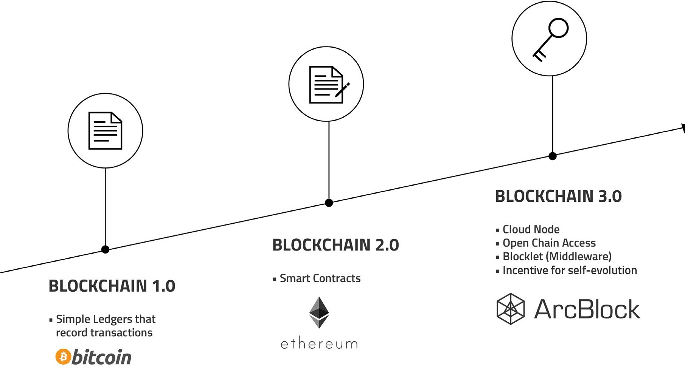

# User Guide

Have you ever wondered why blockchain technology, despite its hype, isn't as easy or common to use as the internet? This guide explains the core ideas behind ArcBlock in simple terms. You'll learn about the common problems holding blockchain back and how ArcBlock provides a clear, user-friendly solution for everyone, from individuals to large businesses.

ArcBlock is a platform designed to make building and using decentralized applications (dApps) simple, scalable, and accessible. It addresses the key challenges that have slowed down mainstream blockchain adoption, such as poor performance, high costs, and a confusing user experience.

The following diagram provides a high-level overview of the ArcBlock ecosystem and its core components.
```d2
direction: down

Developers: {
  shape: c4-person
}

Users: {
  shape: c4-person
}

ArcBlock-Ecosystem: {
  label: "ArcBlock Ecosystem"
  shape: rectangle

  ArcBlock-Platform: {
    label: "ArcBlock Platform"
    shape: rectangle
    style.fill: "#f0f9ff"

    Cloud-Computing: {
      label: "Cloud Computing"
    }

    Multi-Chain-Architecture: {
      label: "Multi-Chain Architecture"
    }

    ABT: {
      label: "ArcBlock Token (ABT)"
      style.fill: "#fffbe6"
    }
  }

  dApps: {
    label: "Decentralized Applications (dApps)"
    shape: rectangle
    style.fill: "#f6ffed"
  }
}

Developers -> ArcBlock-Ecosystem.ArcBlock-Platform: "Builds on"
ArcBlock-Ecosystem.ArcBlock-Platform -> ArcBlock-Ecosystem.dApps: "Hosts"
Users -> ArcBlock-Ecosystem.dApps: "Uses"
ArcBlock-Ecosystem.ArcBlock-Platform.ABT -> ArcBlock-Ecosystem.ArcBlock-Platform: "Powers"

```

This guide provides a non-technical overview of the ArcBlock ecosystem. For a deeper technical dive, please see our [Developer Documentation](./developer-docs.md).

---

### Key Concepts

To understand what makes ArcBlock unique, it's helpful to explore the core challenges it was designed to overcome and the innovative solutions it provides.

<x-cards data-columns="3">
  <x-card data-title="The Problems" data-icon="lucide:server-off" data-href="/user-guide/problems">
    Learn about the common challenges facing blockchain today, including slow performance, high costs, and complexity for everyday users.
  </x-card>
  <x-card data-title="The ArcBlock Solution" data-icon="lucide:solution" data-href="/user-guide/solution">
    Discover how ArcBlock's unique architecture solves these problems, making blockchain applications faster, cheaper, and easier to use.
  </x-card>
  <x-card data-title="Token Economy Concepts" data-icon="lucide:coins" data-href="/user-guide/token-economy">
    Get a high-level introduction to the ArcBlock Token (ABT) and how it powers a self-sustaining ecosystem of developers and users.
  </x-card>
</x-cards>

### The Evolution to Blockchain 3.0

ArcBlock represents the next logical step in the evolution of blockchain technology, often called Blockchain 3.0. It builds on the lessons learned from earlier platforms to create a more robust, flexible, and user-centric ecosystem.



*   **Blockchain 1.0 (e.g., Bitcoin):** Introduced the concept of a decentralized digital ledger, primarily for peer-to-peer currency transactions.
*   **Blockchain 2.0 (e.g., Ethereum):** Expanded on this by introducing smart contracts, allowing for programmable logic and the creation of the first decentralized applications. However, it still faced limitations in performance and user experience.
*   **Blockchain 3.0 (ArcBlock):** Focuses on solving the real-world adoption problems. By integrating cloud computing and a flexible, multi-chain architecture, ArcBlock delivers the performance, user-friendliness, and cost-efficiency needed to bring blockchain applications to a mainstream audience.

### Summary

ArcBlock is more than just a piece of technology; it's a complete ecosystem designed for the new token economy. By prioritizing user experience, leveraging modern cloud infrastructure, and maintaining a commitment to open standards, ArcBlock provides a platform where developers can build the next generation of decentralized applications and users can enjoy them without friction.

To learn more about the specific problems ArcBlock addresses, please proceed to the next section.

<br/>
<br/>

[The Problems](./user-guide-problems.md)