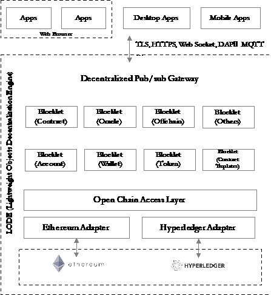

# Architecture
ArcBlock aims to build a scalable, extensible, and easy-to-use platform for building and deploying decentralized blockchain applications. 

## Design Principles 
ArcBlock’s design is based on following core principles: 
	-	The user experience comes first.  
	-	Performance matters. 
	-	The system will be built on an open standard.
	-	The system will build upon an Incentive-driven economy. 

## System Architecture
The ArcBlock platform introduces a suite of revolutionary technologies designed to mainstream blockchain applications by making them easy for the average consumer to use.

### Open Chain Access Protocol 
Our open source protocol provides an abstract layer for accessing underlying blockchains. Similar to an ODBC or JDBC interface to a set of databases, our Open Chain Access Protocol enables your application to work on different blockchains. There’s no need to alter your business logic or work with multiple chain technologies. 

Chain Adapters can be built by the community and encouraged by the incentive mechanism. This will enable ArcBlock to support many blockchain protocols and continue to improve.

### Blocklet 
Blocklet is a serverless computing architecture component for running various types of applications. Use Blocklet for smart contracts, oracle, resource and asset handling, and off-chain business logic. Blocklet communicates with blockchains through ArcBlock’s Open Chain Access Protocol, and can be orchestrated with our Algorand-based consensus algorithm. 

Anyone can use Blocklet to build services and components and contribute them under the incentive system. Community members will receive tokens when others use their contributions.   

### Blocklet Components 
Blocklet Components are pre-built blocklets that form the foundation of the ArcBlock platform. Most of ArcBlock’s features (such as its token services, user identity services, etc.) are implemented with them. Blocklet Components are highly reusable and customizable. 

Incorporate our pre-built Blocklet Components into your applications to get up and running fast. We provide components for user identity management, utility tokens, wallets, messaging, notification services, and more. Use them out-of-the-box, or as customizable starting points for your own creations.  

Blocklet Components can also be built and contributed by the community. They are managed through the ArcBlock Marketplace app. 

### Decentralized Pub/Sub Gateway 
A distributed messaging system supports pub/sub and acts as an API gateway for Blocklets. ArcBlock's gateway uses a decentralized design and secure communication channels. Your applications will run in both web browsers and mobile apps, giving users reactive, real-time experiences. 

The gateway supports various network protocols by default, including WebSocket, DDP,  HTTPS, and MQTT. Advanced developers can extend  the gateway with new network protocols to fit their needs. 

### Marketplace and Token Economy
ArcBlock comes with a fully customizable token economy manager for apps built on the platform. Applications can even build unique utility tokens that inherit all ArcBlock features. 

The ArcBlock Marketplace is a native application built on ArcBlock to allow the community contribute and exchange reusable components (e.g. Chain Adapters, Blocklets, or even applications) .

The diagram below shows a high-level view of the platform architecture. Detailed descriptions of some of the core components appear in the next section. 

## Cloud Nodes
While using a group of cloud services as a node may seem like an unusual approach, a physical computer is simply a group of hardware components that work together (CPU, memory, external storage, bus, network interfaces) in one box. Aside from how the components are distributed and communicate with each other, they're essentially the same. ArcBlock is the first blockchain platform to treat cloud services as nodes, achieving a much higher level of abstraction, enhanced performance, and even better security.  We believe this approach will likely become the de facto standard for future blockchain platform design, and we as a pioneer will lead the trend as technology evolves. 

Although ArcBlock’s preferred node is a cloud node, you can still run ArcBlock in a single traditional node like a server box. In a test or private environment, developers likely run the node locally, or in their test server boxes. 

Using a cloud node won’t compromise the decentralization and security of the system. In fact, it takes decentralization and security to the next level.

The cloud platform’s own security is enforced by cloud service providers. Most likely, the servers and services from a cloud service provider will be more secure and reliable than self-hosting servers, and far more secure and reliable than peer-to-peer connected nodes from homes or mining farms. 

The decentralization aspect of using a cloud node is even more interesting, since a cloud node is likely a distributed service that runs on multiple servers from multiple availability zones, or even different regions. In the future, cloud nodes could be offered by various providers and cloud computing vendors. Some may even be self-hosted mining service providers.  This makes the system much more decentralized indeed. 

