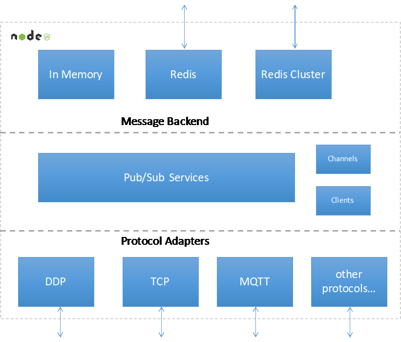
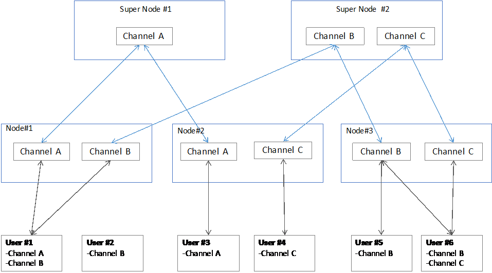
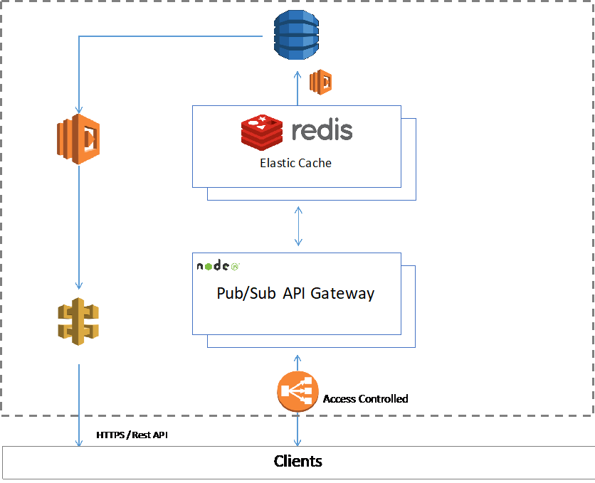
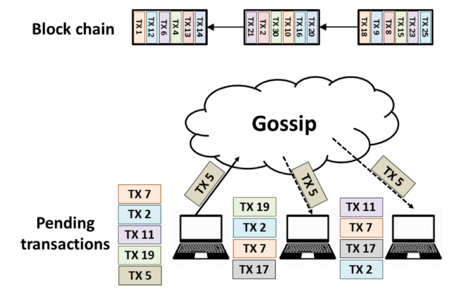

# Core Components
The following sections offer more detailed descriptions of our key components and core algorithm. This section assume that you have an advanced understanding of blockchain technology and computer science. If you’re not interested in detailed information about the components and would rather learn more about using the platform, feel free to skip this section. 

## Open Chain Access Protocol
ArcBlock’s Open Chain Access Protocol enables your application to adapt to a variety of blockchain protocols including Bitcoin, Ethereum, Hyperledger, and more. The Open Chain Access Protocol will be open sourced with an MIT license so that everyone in the blockchain community will be able to contribute, create extensions, and make improvements. We will develop the protocol in private mode, then open source it once we reach the release candidate milestone.

### Open Chain Access Layer
The Open Chain Access Layer defines high-level, generic APIs that enable open connectivity and access to a range of blockchain protocols. The Layer is supported by a Chain Adapter under layer. Each Chain Adapter is implemented for a specific blockchain protocol. 

The Open Chain Access Layer has three levels of APIs: 
Level                           | Description
--------------------------------|--------------------------------------------------------------------------------
Level 1: Common Chain APIs      | This set of APIs provides the foundation for the Open Chain Access APIs. Any Chain Adapters must support all of the APIs included in this level. 
Level 2: Common Chain Data APIs | This set of APIs enables fundamental access to blockchain data, and treats each blockchain under layer as a finite state machine. Chain Adapters may either support the APIs at this level, or alternate capabilities. The set includes APIs that allow applications to query the supported capabilities. A Chain Adapter must support all of the APIs included in this level. However, they may implement a different capacity set. 
Level 3: Native Chain APIs      | This advanced API set exposes the native features of underlying blockchain protocols. While supporting this set is optional, it will maximize your application's ability to use native blockchain features. Supporting the API set at this level is optional for Chain Adapters.

### Chain Adapters
ArcBlock’s Open Chain Access Layer enables the platform to support multiple blockchain protocols. Application developers can choose from several different blockchains, node types, and deployment types. ArcBlock’s Chain Adaptors are the implementations that make the Open Chain Access Layer possible. 

Chain Adapters work like device drivers to translate blockchain under layer protocols into the unified APIs defined in the Open Chain Access Layer. Some of the Chain Adapter implementations require you to combine on-chain and off-chain implementation works together.    The Chain Adapter is also assigned one of three categories, based on the Open Chain Access Layer API set it has implemented. 

We plan to implement Chain Adapters for Bitcoin Blockchain, Ethereum, and Hyperledger first. After we open source the code, anyone will be able to contribute, improve the protocol, or implement their own code. We also plan to support additional blockchain protocols. 

### Chain Adapters Marketplace
Chain Adapters that have been developed or improved by the community will be made available in the ArcBlock marketplace so that everyone can use them. The people who contributed to the adapter will receive rewards when others use it. The incentive model will encourage the community to develop more and better Chain Adapters. In time, ArcBlock will be able to offer a line of high-performance, high-quality Chain Adapters for various blockchains. 

### Relationship with Blockchain as a Service
In the past 12 months, several leading cloud platform providers began offering a new type of platform called Blockchain as a Service (BaaS). BaaS platforms typically offer users a permissioned or public chain, and they’re usually optimized for a specific deployment or node type. IBM Cloud (aka Bluemix) BaaS , which offers a Hyperledger 
Fabric service, was one of the earliest providers. While Microsoft Windows Azure also offers a BaaS platform , it mainly targets the test environment and fast spin-up for developers. Amazon AWS hasn’t officially offered a BaaS yet, but there are third-party VM images that help users quickly deploy blockchain nodes with AWS EC2 instances. 

Existing BaaS platforms work perfectly with ArcBlock. While they simplify the process of deploying blockchain for users, ArcBlock simplifies the process of developing and deploying blockchain apps for software engineers. The first phase of ArcBlock’s implementation will include integrating with cloud computing platforms (through the AWS SDK, for example), so that users can manage BaaS services from directly within ArcBlock applications. 

### Design Principles and Inspiration
To design the Open Chain Access Protocol, we investigated many existing customer solutions, talked to real developers, and learned from the evolution of computers and database systems. For example, the structure for the Open Chain Access Layer was inspired by the open connectivity design seen in databases. 

A look back at the development of database systems and applications reveals many similarities with the evolution of blockchain technology . The position of the blockchain in a typical system is very much the same as the database in a database application system. In many scenarios, it’s fair to say that a blockchain is actually acting as a distributed database. Most of the blockchain itself is built on top of a database, including Bitcoin and Ethereum. That said, we can find inspiration in how database systems evolved. 

## Blocklet
Blocklet is the core of ArcBlock.  More than an application protocol, it’s also a software architect that lays the foundational building blocks of ArcBlock itself. The ArcBlock platform is built on a series of Blocklets. The Open Chain Access Protocol allows Blocklet to communicate with under layer blockchains. The Distributed pub/sub gateway allows Blocklets to communicate with the client-side code live in the user’s browser or mobiles apps. In short, Blocklets are at the center of the entire system. 

### Microservice Architecture 
Microservice architecture  is a perfect match for blockchain applications. A variant of the service-oriented architecture (SOA) style, microservice architecture structures an application as a collection of loosely coupled services. The services should be fine-grained and the protocols lightweight. Deconstructing an application into a variety of smaller services improves modularity and makes the application easier to understand, develop, and test.

ArcBlock is designed as an event-driven microservice that uses Blocklet technology to overcome the inherent limitations of the blockchain. Blocklet communicates with the blockchain under layer through the Open Chain Access Protocol, allowing the application to access external data securely while also maintaining data integrity.

### Serverless Computing
Serverless computing  is a cloud computing execution model in which the cloud provider dynamically manages the allocation of machine resources. Most serverless vendors offer compute runtimes or function as a service (FaaS)  platforms, which execute application logic but do not store data. 

Serverless computing models also work well with blockchains. Most of the Blocklets can be implemented as a serverless program. Manage Blocklets through AWS Lambda, Windows Azure Functions, or another serverless execution environment.

Note that microservice architecture and serverless computing involve different levels of abstraction. Serverless computing can be used to implement a microservice that fits perfectly within a microservice architecture. However, developers can also use serverless computing for other purposes, and it’s not always necessary to use serverless computing to implement microservices. 

### Blocklet Types
Blocklet is inherently flexible and can be used to develop various kinds of applications. This section describes some common types of blocklets. Bear in mind, however, that a Blocklet could consist of one or more of the following units of business logic packaged together. 

#### _Off-Chain Logic_
Because Blocklet is a native microservice, it can access data sources other than the blockchain.  For example, it can connect to a database, external restful API, or any other data source. Blocklet can be used to develop any application logic—even logic that's not related to blockchain. Using Blocklet for standard application development has no overhead.

Real-life, decentralized applications often run quite a few logical components off-chain. Blocklet provides a total solution for application development so that engineers won’t need to use different frameworks to handle different parts of their applications. 

#### _Off-Chain and On-Chain Logic_
It’s very common for an application’s business logic to need both on-chain and off-chain handling, and to require the respective data to be connected. For example, on-chain code can't access external data and events, such as time or market. Calling code or data outside of an on-chain smart contract or blockchain breaks the general trust barrier and reduces confidence in the authenticity of transactions. In these cases, an off-chain Blocklet acts as a bridge that connects on-chain and off-chain logic to bring the full business logic together. 

#### _Asset and Resource Handling_
Applications usually need to handle resources and assets like photos, videos, music, and documents. Because blockchain isn’t designed to handle large amounts of data, a typical blockchain application handles those resources and assets with off-chain solutions. While there are different ways to accomplish this, the traditional solution involves using a service like AWS S3, or a more decentralized solution like IPFS. 

Regardless of the approach you take, Blocklet will be able to communicate with your assets and resource storage system. Sometimes assets may need to be mapped with their on-chain token or identifiers, or verified through the records on the blockchain. Blocklet is the perfect location for these kinds of logic. 

#### _Smart Contracts_
By communicating with on-chain code securely through the Open Chain Access Protocol, Blocklet enables you to implement high-performance smart contracts while maintaining the trust barrier and verifying the authenticity of transactions. 

It’s up to the engineer to decide how much logic should run on-chain vs. off-chain. At one extreme, the engineer could simply treat the blockchain as a state machine and put most of the business logic inside the Blocklet. At the other extreme, the engineer might develop a complex, fully on-chain contract where the Blocklet merely serves as a stub for triggering or monitoring activity from the on-chain execution. 

#### _Oracle_
In Blocklet design, Oracle is simply a type of smart contract that takes external data sources as event triggers. Blocklet makes it easy to implement Oracle by design. 

Blocklet-based design also compels engineers to consider the division between on-chain and off-chain logic during the design and development phases. This improves the efficiency of these phases without compromising security and trust. 

### Blocklet Implementation
In the first phase of ArcBlock development, we will implement Blocklets with a local test environment and AWS. The local implementation is for test purposes only. Production will be based on AWS so that we can take advantage of the many advanced design features AWS offers. 

In the future, we will support Windows Azure, Google Compute Engine, IBM Bluemix, and other computing platforms. We also plan to support Docker and open source FasS solutions for Blocklet so that users can easily build and deploy their own Blocklets without using any cloud services.

Because Blocklet itself is a type of application protocol and architecture, it’s possible to implement it with different languages and frameworks. Our initial implementation will be based on Node.js and GO.

### Blocklet Components 
Blocklet Building Blocks are pre-built blocklets that lay the foundation for the ArcBlock platform and most of its features, such as token and user identity services. Blocklet Building Blocks are highly reusable and customizable components. 

## Decentralized Pub/Sub API Gateway
A distributed messaging system supports pub/sub and acts as an API gateway for Blocklets. ArcBlock's gateway uses a decentralized design and secure communication channels. Your applications will run in both web browsers and mobile apps, giving users reactive, real-time experiences. 

### API Gateway
An API gateway is essential in microservice architecture. An API gateway is a façade that provides a simple API interface to a complex subsystem. It essentially decouples the interface that clients see (in our case API consumers, which could be mobile apps, web clients, or thin clients) from the underlying implementations. In ArcBlock, all features are implemented with Blocklets. Rather than communicating directly with clients, Blocklets communicate through the API Gateway. 

The gateway supports various network protocols by default, including WebSocket, DDP,  HTTPS, and MQTT. Advanced developers can extend  the gateway with new network protocols to fit their needs.

 

### Pub/Sub
Publish–subscribe is a messaging pattern where message senders (publishers) categorize published messages into classes without knowing which subscribers will receive them, if any. Similarly, subscribers only receive messages assigned to the classes they've expressed interest in, without knowing which publishers there are, if any. 

The publish–subscribe pattern is a sibling of the message queue paradigm. It’s typically a single piece in a larger message-oriented middleware system. Most messaging systems support both the pub/sub and message queue models in their APIs. This pattern provides greater network scalability and a more dynamic network topology, resulting in decreased flexibility in terms of modifying the publisher and the structure of the published data (This is not a disadvantage for blockchain applications).

### Decentralized and Secured
We use a completely decentralized design to implement and simplify cloud services. ArcBlock’s API Gateway can be used out-of-the-box with zero configuration—just start it up and it will do its magic. It also features name-based addressing, clusters (i.e. automatic load balancing), and perfect secrecy (all network traffic is encrypted).

  

## Decentralized Media and Assets 
While ArcBlock’s core components weren’t designed to handle media and assets, Blocklet can be used to handle them with support from other systems. Blocklet can also help you create off-chain data, or verify off-chain data with the on-chain data. . Today, most decentralized applications handle media and assets with off-chain logic. They either use a cloud-based centralized solution like AWS S3 or Microsoft Windows Azure’s storage service, or a decentralized solution like IPFS  or Swarm . 

Rather than reinventing the wheel, we encourage application developers to adopt the best-fit solution for handling their media and assets. We predict that most application developers will use centralized solutions, which are the simplest and most mature. In addition, media and resources don't necessarily have any relationship with blockchain data in most applications. Other developers might consider using IPFS or a hybrid solution. ArcBlock allows you to decide which solution is best for your application—it works with either technological approach. 

While the ArcBlock platform uses AWS to handle its own media and assets, we may consider moving toward a decentralized system in the future. 

## Client Library/Framework
ArcBlock provides libraries and frameworks for client application development. These libraries support web, iOS, and Android platforms. With the Electron Framework , the web version can be easily encapsulated and packaged as a desktop application for Windows and Mac OS. 

The version for the web is a simple communication library that works with HTTPS and WebSocket to provide a real-time and reactive user experience. It works with nearly all other web frameworks,  allowing you to pick the framework you’d like to work with, such as Meteor, VUE, or React.  

This is an important advantage for application development. Engineers can spend most of their time handling the client side and user experiences, and write most of the code in this layer. Thanks to ArcBlock, however, now they can develop client applications the same way they build traditional, non-blockchain applications. Our design enables developers to work with their favorite frameworks and tools so they can draw upon community resources and support.   

## Algorand
ArcBlock is among the first blockchain startups to adopt Algorand  in production. 

Algorand was founded by Silvio Micali, winner of the 2012 ACM Turing Award. Micali is a pioneer in cryptocurrency and blockchain technology. He was instrumental in the development of many of the building blocks of cryptography, published works on game theory and Byzantine Agreements, and even launched a micropayments startup. When Micali saw Bitcoin, he thought it could be improved; Algorand is the result of that quest.

Algorand  involves suddenly and randomly selecting a small group of nodes to be in charge of the next block, then receiving a reward in the form of a percentage of the block transaction. This must be done in a way that can’t be manipulated by an adversary. No one selects the group; it’s selected by hash instead. Micali suggests taking a pseudo-random generator which is pre-specified and elongating as much as you need to select the committee. The group decides the next block via a redesigned Byzantine agreement in which a leader is picked randomly from the group. 

ArcBlock uses Algorand and its variant in a number of places. For example, we use Algorand to pick where the smart contract Blocklet will execute from, as well as for the high-performance blockchain that powers our native tokens. We will disclose more details on implementing Algorand in the ArcBlock in the future when we reach release candidate milestone.

 

