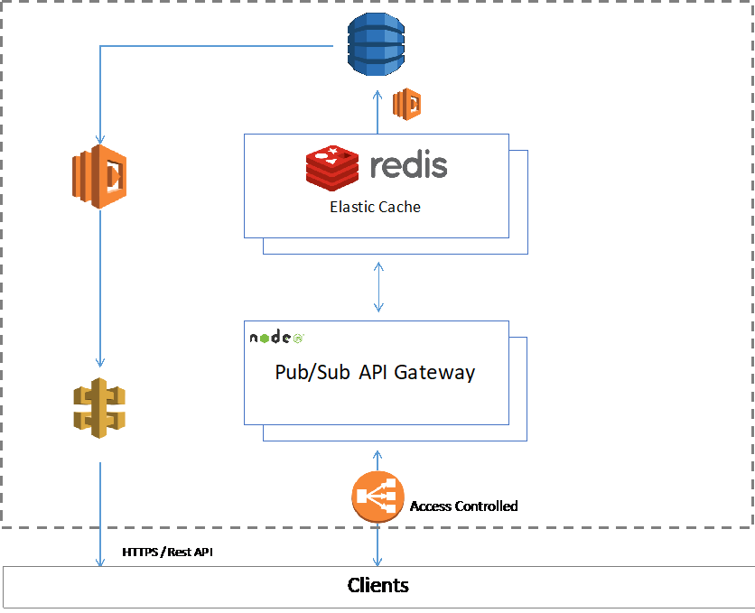

# 核心部件

下面我们逐个更为详细地介绍核心部件和关键算法。这一部分供有较深技术基础的读者阅读，如
果您不想了解这些部件的细节而更关心ArcBlock应用相关内容，可以跳过这部分直接阅读后面的
内容。

## 开放链访问协议

ArcBlock的开放链访问协议使应用能够适配多种不同的区块链协议，包括并不限于比特币区块链
（Bitcoin）、以太坊（Ethereum）、Hyperledger等。

开放链访问协议将采用MIT协议的开源方式发布，使得区块链开发社区任何人都可以提供、贡
献、扩展和改进这个协议。 我们在开发阶段采用封闭方式进行，在项目到达RC1阶段发布目标时
开源。

### 开放链访问层

开放链访问层定义了一组高层通用API来使得应用通过这些API可以访问一系列不同协议的区块
链。 开放链访问层通过其下层的链适配器来支持不同的区块链协议。每个链适配器匹配每个特定
区块链协议发挥作用。

开放链访问层定义了三个不同等级的API：

| 等级                 | 说明                                                                                                                                                                                                                                                       |
| -------------------- | ---------------------------------------------------------------------------------------------------------------------------------------------------------------------------------------------------------------------------------------------------------- |
| 等级1: 基础链API     | 这是开放链访问层的最基础的API集合。 任何链适配器必须实现这个等级的全部API支持。                                                                                                                                                                         |
| 等级2: 基础链数据API | 这个等级的API使得应用可以把区块链作为一个有限状态机来访问。根据不同的下层区块链协议或者不同的链适配器实现可能会支持不同程度的能力集合。本层的API集合包含能够查询下层适配器支持能力的API。 任何链适配器必须实现这个等级的API，但其能力集合支持可能不同。 |
| 等级3: 原生链API     | 这是高等级的API可以使用下层区块链协议的高级功能。对本层的API支持是可选的，但是这能最大化利用区块链原生功能来扩充你应用能力。 链适配器可以有选择地支持这个等级的部分或全部API。                                                                          |

### 链适配器

ArcBlock的开放链访问协议使得支持多种不同的区块链协议成为可能。 应用开发者可以从几种不
同的区块链协议，不同的节点类型，不同的部署方式中自由选择最合适的方式。 上述链访问层定
义了统一的API，然而这些API的具体实现来自于链适配器。

链适配器就如同下层区块链的设备驱动程序来把下层区块链协议转换为应用更容易使用的方式。
部分链适配器可能需要包含链上和链下的代码，两者需要一起协调配合工作。 例如在一个以太
坊的适配器可能包含链适配器事先部署好的以太坊上的智能合约，以及和这些智能合约配合的代
码。根据上述的3个API集等级，我们把链适配器也分为3个相同的等级来表示他们可以支持到什
么等级的API。

我们首先会提供比特币区块链、以太坊（Ethereum）和Hyperledger这几种最常用的区块链系统
的适配器实现。 当系统开源后，任何人都可以贡献、改进开放链访问协议，或实现自己的代码。
我们也计划支持更多的区块链协议。

### 链适配器市场

链适配器可以被社区成员自己遵循协议开发或改进，并且这些用户生产的链适配器可以在应用市场发布供他人使用。 这些链适配器的作者会在其作品被使用的时候获得代币奖励。 这个激励模型会推动社区有更强的动力来开发更多更好的链适配器，可以预期未来ArcBlock会拥有大量高性能高质量的各种区块链协议的适配器。

### 和“区块链即服务”（BaaS）的关系

在过去一年中，若干领先的云服务平台开始提供“区块链即服务”（Blockchain as a
Service，BaaS）的平台。BaaS平台一般为用户提供联盟链及公开链两种服务，并根据不同的
服务类型进行不同的架构设计及优化。目前最早的主要提供商包括 IBM 的 Bluemix上的BaaS3
服务，主要提供Hyperledger Fabric的服务。 Microsoft Windows Azure 也开始提供BaaS4
,服务，目前主要还是针对开发者快速部署测试环境为主。 Amazon 的 AWS虽然还没有正式提供BaaS服
务，但是借助其虚拟机映像（VM Images）市场，用户也可以较快速部署以达到类似效果。

BaaS平台和ArcBlock的开放链访问协议是一对完美的组合，这些云服务平台的BaaS服务提
供了底层区块链部署的快捷方式，而ArcBlock为这些用户部署的区块链开发应用变得更为方
便。ArcBlock第一阶段会集成第三方云服务平台的API（例如AWS SDK），这样用户可以一次性
从ArcBlock来管理云服务端的BaaS或者部署云服务中的区块链节点。

### 设计思想

为设计开放链访问协议，我们调研了现有许多客户解决方案，访谈了许多开发者，并从计算机和
数据库技术发展历程获得启发，并结合区块链技术的实际情况设计了这个架构。举例而言，开放
链访问层的结构的灵感来自数据库的开放连接设计。

回顾数据库系统和应用发展史，便可发现其与区块链技术演进存在许多相似之处5.。在大部分区块
链的应用系统架构中，区块链的地位与数据库应用系统中的数据库几乎相同。在许多场景中，区
块链可以说就是分布式数据库。包括比特币和以太坊，绝大多数区块链自身建立在数据库之上。
换而言之，很多数据库发展史中的理念和经验都可以应用于区块链，至少可以从中获得有益启
发。

## 基石程序

基石程序（Blocklet）是ArcBlock平台的核心基础。它不止是一种应用协议，也是一种软件架构，
更是ArcBlock本身的构件基础。ArcBlock平台本身就是由一系列Blocklet所组成的。ArcBlock开放
链访问协议让Blocklet可以和区块链通信，而分布式订阅网关则让基石程序可以和植根于用户浏览
器或移动App的客户端代码通信。总之，Blocklet处于整个系统的核心位置。

### 微服务架构

微服务架构（Microservice architecture）与区块链应用完美契合。 作为面向服务的体系架构
（SOA）的一种变体，微服务架构把应用分拆为一组相对独立的松散耦合的服务。 这些服务通常
会被设计得非常单一和简单。把应用分拆成微服务架构的这种设计能增强应用的模块性，让应用
更加容易理解、开发和测试。

ArcBlock被设计成一个事件驱动的微服务架构，可以应用Blocklet技术克服区块链的天然限制。基
石程序通过开放链访问协议来和下层的区块链通信，保证应用安全访问外部数据，同时保持数据
完整性。

### 无服务器计算环境

无服务器计算（Serverless computing7）是现代云服务开始流行的一种新型计算模式，云服务
提供商能动态地管理和分配计算资源而使得服务不需要专门的机器资源。 大部分云服务提供商提
供的无服务器计算环境方式是“函数即应用” (FaaS)8，这些计算环境只执行代码而不保存任何状态数据。

无服务器计算方式和区块链应用也非常契合。绝大部分基石程序都能够采用无服务器方式来实现。 通过AWS提供的Lambda服务，Windows Azure的Function 服务，以及其他的“函数即应用”服务，可以有效率地实现Blocklet。

需要注意的是，微服务架构和无服务器计算是在不同层面的抽象，无服务器计算可以用来实现一个微服务架构下的微服务。开发者也可以采用无服务器计算方式来实现其他类型的应用，未必一定采用微服务架构。

### Blocklet的类型

基石程序（Blocklet）被设计得具有很强灵活性可用来开发各种应用。这一章节介绍基石程序部分常用类型。需注意的是，实际上一个Blocklet可能包含下述一个或多个业务逻辑类型组合在一起而成。

#### _链下逻辑的Blocklet_

因为Blocklet是原生代码实现方式，它可以访问除区块链以外的数据源。举例而言，Blocklet可以连接数据库、外部REST式API或其他数据源。Blocklet可用来开发常规的应用逻辑——即使该逻辑可能与区块链无关。利用Blocklet来开发常规的应用也不会有额外的负担。

现实的去中心化应用常常在链下运行相当多的逻辑组件。Blocklet提供整体解决方案，以便工程师无须调用不同框架处理他们应用的不同部分。

#### _链下与链上逻辑结合的Blocklet_

对于一个完整的应用而言，需要同时处理链上与链下的相应数据连接是常见情况。例如，链上代
码无法访问比如时间或市场这样的外部数据和事件。将链上智能合约或区块链的代码或数据调用
在外，会打破常用信任围栏、降低对交易真实性的信任。在此情形中，一个链下Blocklet可以扮演
连接链上链下逻辑的桥梁，使得整个业务逻辑完整。

#### _资源和媒体文件的处理_

一个完整的应用通常都需要调用处理媒体和资源文件，例如图片、视频、音频、文件等。 区块链
并不适合用来保存大量数据，通常区块链应用都是采用链下的方法来处理这些数据。现有一些不
同的方法来处理这些数据，传统的方法有采用中心化的方式如AWS S3，或者更去中心化的方式
如IPFS等。

无论采用哪种链下方式处理这些数据，Blocklet都可以直接和这些资源和媒体文件的存储系统对
接。有些时候这些链下的数据需要和链上的某些Token、标识或校验数据来对应，或者要通过在
区块链上保存的记录来校验，此时Blocklet是处理这些逻辑的最佳场合。

#### _智能合约_

通过和链上的代码采用开放链访问协议的协同，Blocklet可以用于实现更好性能的智能合约并且确
保安全可信的界限以及验证交易的合法性。

采用Blocklet开发智能合约，设计合约的工程师需要确定合约的逻辑哪些必须是链上实现哪些是
链下实现。 在一个极端方式下，工程师可以把区块链作为一个状态机来对待，而把主要的逻辑集
成在链下完成；而在另外一个极端下，工程师可以把合约全部逻辑在区块链上用原生方式全部完
成，而链下部分只是一个调用接口。 不同性质的应用，需要采用不同的策略来达到最佳的灵活性
和最佳的安全可靠性。 Blocklet在智能合约的设计上给工程师最大的灵活性。

#### _Oracle_

在Blocklet的设计之中，Oracle其实就是一种智能合约只不过它可能使用一些外部可靠来源的数据
作为触发条件。Blocklet的设计统一化了Oracle类型合约和一般智能合约，使其更容易设计和实现。

Blocklet的设计也使得设计和实现合约的工程师始终处于控制的地位，在设计开发阶段就清楚地界
定哪些逻辑必须在链上完成，哪些更适合在链下。这将在提高设计的有效性的同时不牺牲系统的
安全和可信任。

### Blocklet 的实现方式

在第一阶段ArcBlock开发中，我们首先会支持本地的测试环境和亚马逊AWS的支持。本地的测试环境专门用来开发和测试。产品的运行环境基于AWS部署，因此我们可以充分利用很多AWS提供的高级特性。

在未来，我们将支持Windows Azure， Google的Computing Engine，IBM Bluemix和其他计算环境。 我们也计划支持Docker和开源的FaaS的Blocklet实现，这样用户完全可以建立自己的Blocklet执行环境而不依赖于任何云服务。

Blocklet本身只是一个应用层的协议规范和架构，因此可采用各种不同的语言或框架加以实现。
我们的初始实现会基于Node.js 和Go来开发。

### Blocklet组件

如前介绍，Blocklet组件就是一组事先设计好、可以重用的Blocklet。 Blocklet组件是ArcBlock本
身的基础， ArcBlock自己就是通过一组Blocklet组件构件起来的。 Blocklet组件是可以高度可用的部件。

## 分布式发布/订阅应用网关

这是一个分布式的支持发布/订阅（Pub/sub）消息模式的API应用网关。Blocklet需要通过API应
用网关与客户端通讯。 ArcBlock这一网关设计采用去中心化的设计和安全加密的通讯协议。 应用
可以运行在浏览器或是移动App中，为用户提供一个实时的，响应式应用体验。

### API网关

API网关是微服务架构的一个重要组成部分。API网关把复杂的系统对外以简单的API接口形式
提供服务，它的根本作用是解耦客户端（在我们的系统中，API的消费客户端指移动应用、Web
应用以及“瘦”区块链节点应用等）和服务端实现之间的关系。在ArcBlock中，所有具体功能都是
Blocklet来提供的，Blocklet并不直接与客户端通讯，而是通过API网关来提供。

网关支持多种不同的网络协议，我们默认支持WebSocket，DDP，HTTPs和MQTT等协议。高级
开发者可以根据需要扩展API网关来支持新的网络协议。

_
<h3>图: 基于Node.js的一个参考实现(2017年12月可用版本)</h3>
_

### 发布/订阅

发布/订阅（Pub/sub）是一种消息系统的设计模式：消息发送者按照分类发送消息，而不需要知
道具体是哪些接收者来接收这些消息。类似地，消息接收者只关心他们需要接收的消息类型而不
需要了解具体的发送者。

发布/订阅（Pub/sub）模式是类似消息队列的一种设计，它通常在一个消息驱动的中间件系统中
起关键的作用。大部分基于消息驱动的系统设计都同时支持发布/订阅（Pub/sub）模式和消息队
列模式。这个设计模式往往能提供非常强的网络扩展性（Scalability）和更加动态的网络拓扑结
构，但往往也降低或限制发布/订阅数据格式的灵活性（在区块链应用中，这并不是一个缺点）。

### 去中心化和安全

我们采用完全的去中心化设计来实施并简化云系统服务。 ArcBlock的API网关设计不需要配置就
可工作——只要运行它，它就会自动发现其他节点并协同工作，如有魔力一般。它设计有采用名
字空间的寻址方式，集群（自动负载均衡）和安全设计（所有网络通讯采用加密通道）。

_
<h3>图: 去中心化的消息和发布/订阅服务工作方式示例</h3>
_

## 分布式的媒体和资源服务

ArcBlock的设计没有为媒体和资源（如文件、图片、音乐、视频等）本身作专门设计，但是Blocklet可以借助其他系统支持完成对媒体和资源的处理，并能与区块链上的记录建立联系。在今天的网络服务环境下，媒体和资源往往是一个区块链的链下服务——从中心化解决方案，诸如AWS S3、Windows Azure存储服务等，到去中心化的服务如IPFS 或者Swarm等分布式方案。

我们的设计思路是没有必要重起炉灶，因此鼓励应用开发者采用自己认为最合适的方式来处理媒
体和资源。 我们预计近期大部分应用仍然会采用传统的中心化方式来处理媒体资源，因为这是
最简单成熟的方式，同时这部分数据也往往和区块链本身联系较为松散。 一些应用可能会采用
IPFS或者混合的方式（中心化 + 分布混合使用）。ArcBlock的设计可以和各种开发者选择的方式
轻松组合。

作为参考，ArcBlock自己的网站和应用使用的媒体服务采用AWS的中心化方式提供，我们不排除
未来在分布式存储技术更加成熟后将推出专门模块进行处理的可能性。

## 客户端库和框架

ArcBlock为应用客户端提供了框架和库方便应用的开发。这些库包括Web的版本、iOS版本和
Android版本。 通过例如Electron Framework,这样的框架，Web版本可以轻松被封装成为PC上
的应用客户端软件。

客户端和API网关之间的通讯协议基于HTTPS和WebSocket，能提供安全、实时、响应式用户体
验。 Web版本的库可以和各种主流的Web开发框架配合，开发者可以任意选择他们最熟悉的开发
框架， 如Meteor、VUE或React等。

这一部分对于开发应用而言是非常重要的部分，事实上很多应用开发者将主要在这个层次完成大量应用客户端和用户体验的开发工作，可能也是整个项目中代码量最多的部分。 在ArcBlock的帮助下，我们尽可能地让这些客户端部分的开发工作和传统非区块链应用开发方式非常接近，推荐
的框架和工具也采用流行和标准的做法，开发者可从各个工具和框架的社区获得支持，因此这部分细节在本文档不做专门描述。

_
<h3>图：客户端和分布式发布/订阅API网关通讯的
亚马逊AWS参考实现示例( 2017年12月可用版本)</h3>
_

## Algorand

ArcBlock应该是最早在产品中使用Algorand算法来解决区块链应用实际问题的公司。

Algorand 算法由2012年ACM图灵奖得主 Silvio Micali发明。 Micali是加密货币和区块链领域的先
驱，其研究成果是许多加密学及区块链技术基础，他出版了博弈论、拜占庭协议相关著作，甚至
创立了微支付初创公司。当接触比特币后，Micali发现有可以改进的空间，Algorand就是这一探
索的成果。

_
<h3>图: Algorand的交易流程说明 (引用来源) </h3>
_

Algorand采用突然和随机挑选一小群节点来处理下一个区块，并根据交易量比例来获得激励的
做法。这必须保证在防止攻击者任意操控的情况下完成这个选择。没有任何人来选择这一小群节
点，而是通过hash值来选择；Micali建议采用一个随机数发生器来产生（这个选择一小群节点的
hash）。被选择的一小群节点采用随机方式挑选一个领导者并采用一个改进的拜占庭协议来获得
共识。

ArcBlock在几个不同的地方采用了Algorand及其变体。例如我们采用Algorand来挑选执行智能合
约的执行和验证节点，以及我们采用Algorand来作为我们高性能代币的承载区块链的共识算法。
我们会在项目到达发布阶段公布ArcBlock是如何实现和改进Algorand算法的细节。
