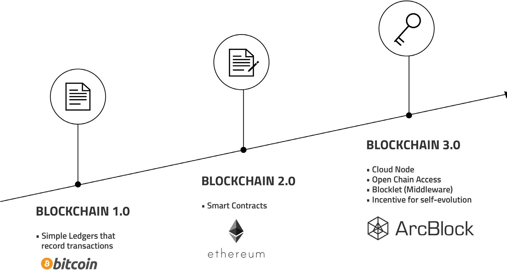
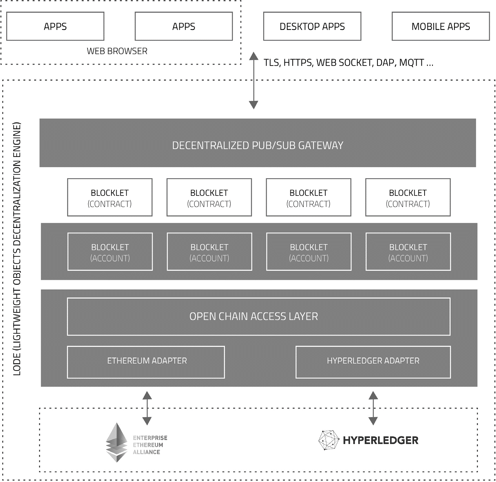
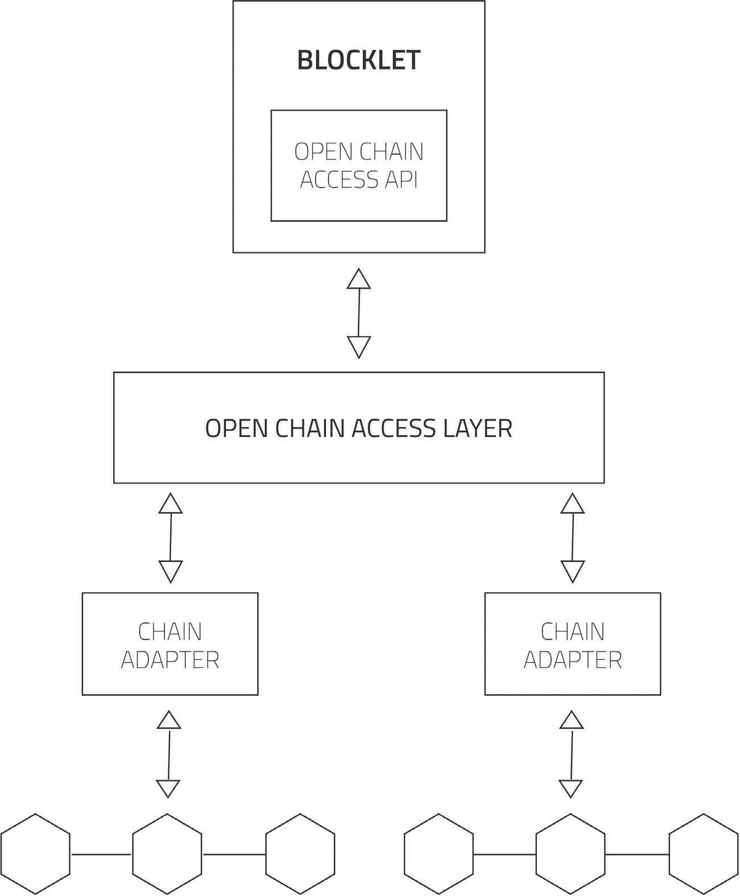
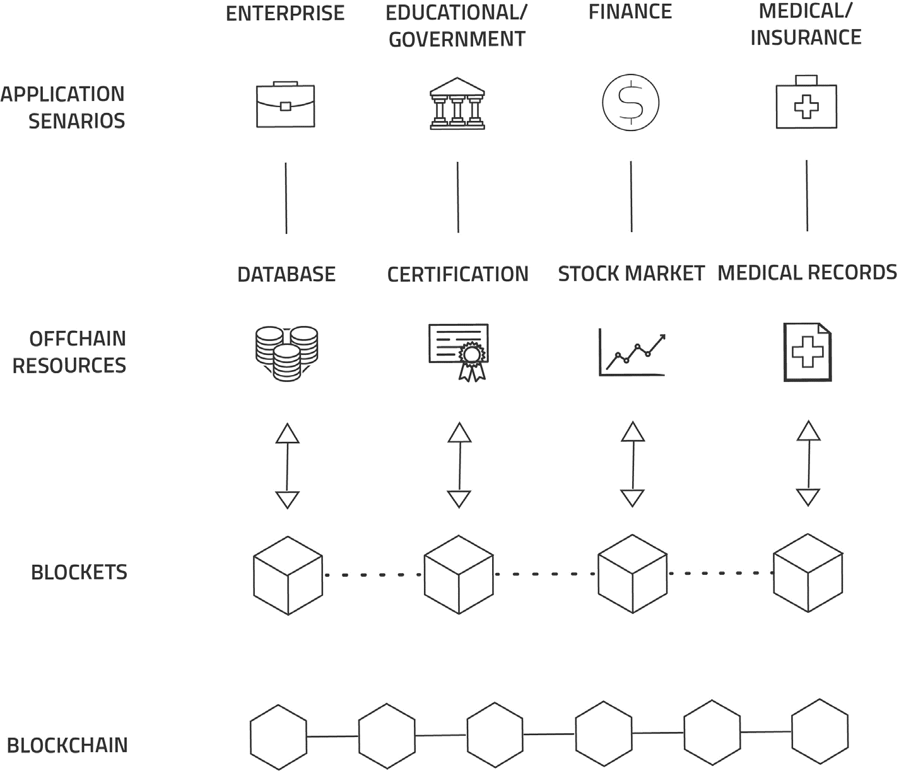
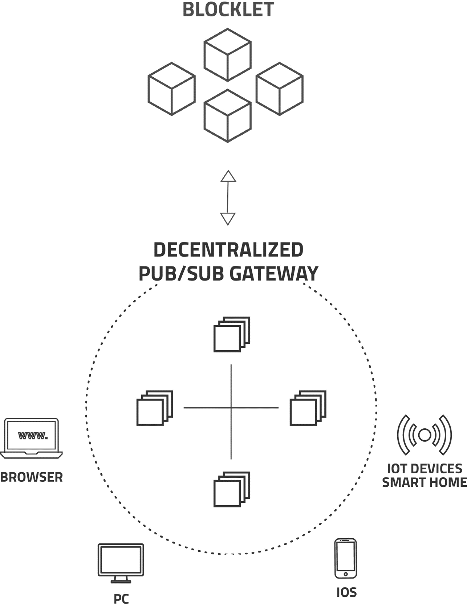
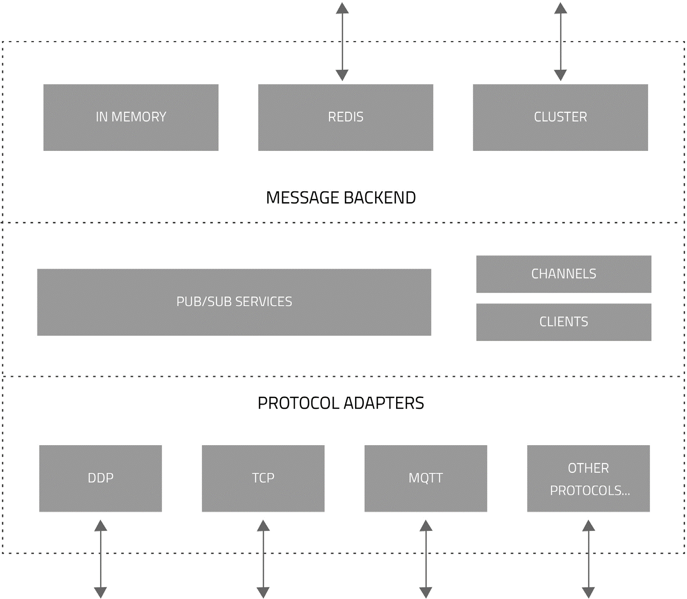
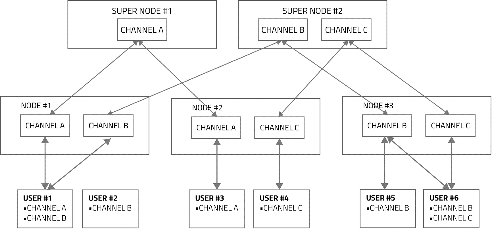
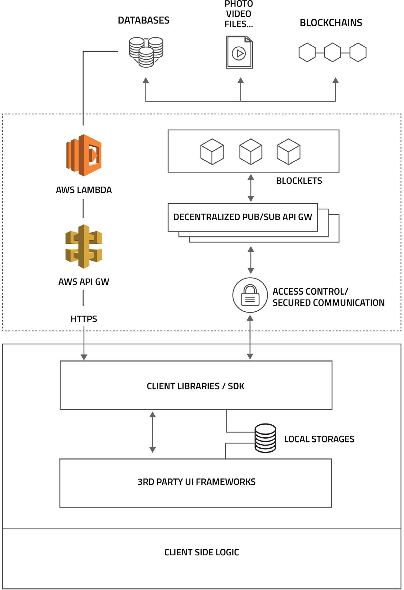
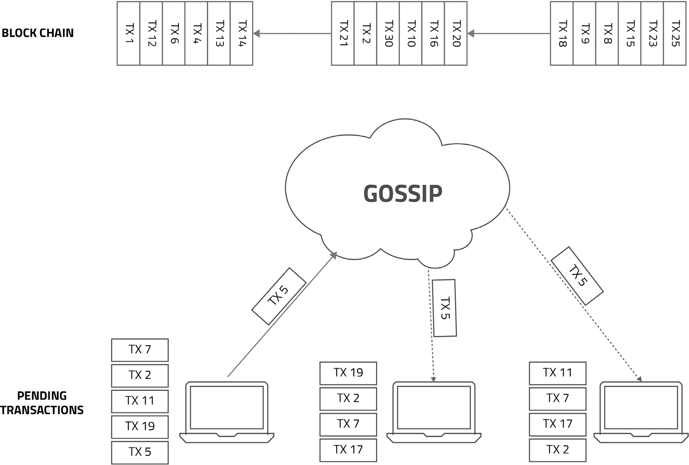
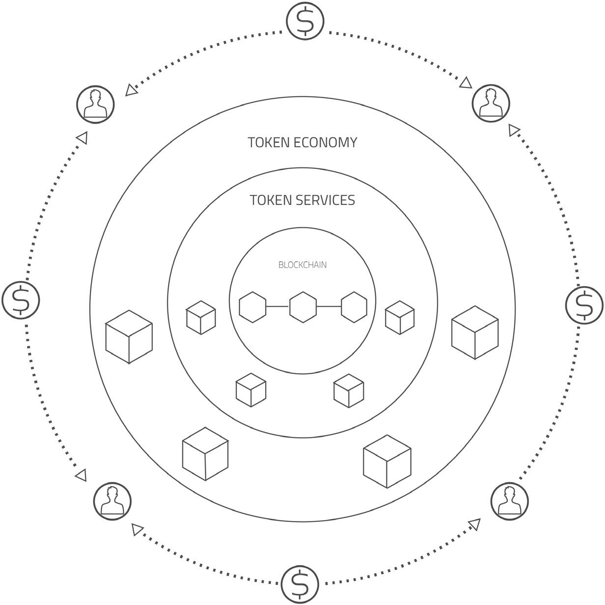

# 概要

## 目的
本技术白皮书旨在对“区块基石”（ArcBlock）服务平台进行高层技术概要介绍，读者需要对云
计算、去中心化应用和区块链技术有基本了解才易于理解本文内容。白皮书在文末提供了系列相
关资源和文献帮助读者建立对区块链技术的基础理解。

## 范围
本技术白皮书提供对“区块基石”（ArcBlock），一个为开发和部署去中心化应用而设计的服务
平台和生态系统的技术概要介绍。 本文描述了其核心组件并详细介绍了其架构设计及关键部件设
计细节。

本文档仅为外界了解该系统提供必要的信息。我们可能在不事先通知的情况下对本文描述的产
品、系统架构或程序进行修改或改进。

本文档是对英文版技术白皮书的中文翻译，尽管我们尽量保证精确性但仍可能与英文版本存在微
小偏差，如果本文内容和解释出现和英文版的区别则以英文版本为基准。

## 相关文档
“区块基石”官方网站: https://arcblock.io 
“区块基石”技术白皮书（本文）: https://arcblock.io/whitepapers/technical.pdf

# 前言
“区块基石”（ArcBlock）是一个专门用于开发和部署去中心化区块链应用的服务平台和一个多方
参与形成的生态系统。ArcBlock不仅提供基础部件服务以方便使用区块链，而且能比今天的区块
链系统支持更复杂的商业逻辑。它能帮助您将已有的系统和服务与区块链建立连接，使得你可以
把现有业务的数据、用户、商业逻辑等应用在区块链驱动的新应用之中。

“区块基石”平台首要目标是解决目前区块链应用领域的几个普遍存在的、阻碍区块链技术得以在
公众范围内普及应用的问题。我们对ArcBlock引入的独特创新可能推动整个区块链技术加速前进
充满信心。

## 今天区块链面临的问题
今天的区块链应用仍处于“婴幼儿期”，有许多问题阻碍了开发者和企业在区块链上创建能够广泛
传播的去中心化区块链应用，兹列如下：

### 性能低下
性能低下，是今天的区块链技术面临的核心挑战之一。 比特币的区块链被设计成每秒处理7笔交
易， 以太坊只能处理每秒几十笔。2017年12月初，一个简单的“以太猫”（CryptoKitties1
）游戏
就给以太坊（Ethereum）网络造成大规模拥塞并导致交易费（gas）激增。

而今天一个合格的消费者应用必须能够处理数以千万计的日活跃用户。更重要的是，有一些应用
必须到达一个足够大的用户临界点才会有实用价值。支撑这些应用的平台必需具备处理大量并发
用户的能力。

良好的用户体验需要秒级内甚至毫秒级的可靠反馈。延迟令用户迷惑，导致今天的区块链应用无
法与传统的非区块链应用竞争。

### 非消费者友好
今天的区块链应用还只是为知道如何使用的极少数极客用户而造，而非面向主流的消费者用户。
几乎所有区块链应用都需要用户在自己的计算机端运行一个“节点”或至少安装一个“轻节点”才能使
用， 学习使用成本高昂导致区块链应用难以在普通大众普及。

举例而言，“以太猫”可能是迄今出现对用户最为友好的去中心化区块链应用了，它仍需要用户在
浏览器安装Metamask2
这个轻钱包插件才能使用，同时用户必须知道如何买到以太币以及如何适
应和使用Metamask插件界面才能使用。

要吸引大量用户使用，区块链应用必须和今天常见网页和移动端应用一样简单好用。对消费者而
言，区块链技术本身应该是完全透明的。

### 使用费高昂
今天使用区块链费用非常高昂，也是阻碍主流大众接受采用区块链技术的一大主因。这还限制了
开发者创建免费应用的灵活性，正如今天的网页和移动端应用一样，用户不需要为每一个动作和
请求单独付费。如同今天的互联网，区块链技术应该能够支持免费应用。

让区块链可以免费使用，是区块链技术广泛传播普及的关键。能够提供免费服务的平台让开发者
和企业有动力提供更好更创新的应用来让用户付费，而不是让他们为基本的区块链操作来付费。

### 平台“锁定”风险
和很多早期计算机技术发展过程类似，现在的区块链存在严重的“平台锁定”问题。开发者不得不
为支持哪种区块链实现技术而做出选择，应用的设计和代码被开发初期选择的区块链平台“锁定”
，导致未来难以灵活更换。

应用开发者不希望他们的应用锁定在特定的区块链技术上，他们需要自由选择的权利，能自由地
评估、使用和切换最适合自己业务的技术基础。一些应用有时也需要能支持多种不同底层技术来
为自己的用户提供最佳体验。

### 功能匮乏
今天在媒体和布道先驱者为去中心化区块链应用描绘了光明的未来，尤其是最近数字加密货币价
格屡创新高的背景下，公众对区块链技术抱有极高的期望。 然而，现实是今天的区块链技术仍处
于“婴幼儿”期，绝大多数区块链应用缺乏足够的功能而且没有一个有效机制推动社区来贡献这些
缺乏的功能。

区块链协议一个特点是分叉比较容易，最近出于各种动机对区块链进行硬分叉的现象此起彼伏。
然而，这些硬分叉对区块链的功能贡献微小，反而分散了计算资源、割裂了用户社区。今天各种
区块链系统的内在激励机制设计没有鼓励人们对链技术和特性进行贡献。

## “区块基石”平台
“区块基石”（ArcBlock）平台通过创新的革命性设计来解决上述问题。不同于其他类似产
品，ArcBlock是一个完整的<strong>平台服务</strong>，而不是一些软件包或包裹性API集合。它是一个结合了区
块链和云计算技术的完整解决方案。

ArcBlock更是提供一个内在激励机制驱动的<strong>功能模块和应用市场</strong>，从而形成一个生态体系。
ArcBlock里的<strong>“矿工”</strong>可以提供的，不仅仅是计算资源，而且可以提供的是可重用的模块、新的服
务甚至是可以直接部署使用的应用。 这些提供功能和应用的<strong>“矿工”</strong>在自己的服务被使用时就会获
得代币奖励，从而形成一个能够不断完善、自我成长的服务平台。 ArcBlock服务平台并不只是我
们单独创建的，而是由整个社区一起来开发创建的，我们只是最初推动的一群人而已。

ArcBlock引入了<strong>“开放链访问协议”</strong>（Open Chain Access Protocol），这使得应用可以通过
它连接多种不同的区块链协议。 开发者将重新拥有方便评估不同区块链协议的自由，甚至可以在
不同的区块链协议之间方便地切换。 当区块链技术本身发生演化时，确保应用能轻松跟随新区块
链技术一起演进。“开发链访问协议” 消除了现存区块链技术的“平台锁定”风险，并能让一些
区块链应用跨链而造，大幅度提升开发者和用户的体验。

<strong>“基石程序” （Blocklet）</strong>是另一项革命性设计，它吸收了<strong>最新的微服务（Microservice）</strong>架构和
<strong>无服务器计算方式（Serverless Computing）</strong>的优势。 Blocklet是一种高层应用协议，可以
在任何平台上以任何语言来实现，这使它可以充分利用平台和语言的原生特性而获得远优于虚拟
机运行的最佳性能和开发体验。通过前面说明的“开发链访问协议”，Blocklet可以和区块链通信。

Blocklet不止是连接区块链协议，也可以访问任何外部数据源，因此它能完成链上和链下的两种计
算方式并且将它们联系起来。

由此可见，我们上述设计旨在致力于打造一个<strong>高性能、用户友好、成本经济、不被现有特定区块
链协议锁定</strong>的应用服务平台。我们相信 Blocklet的设计思想代表下一代区块链3.0应用的主流模
式。

*
<h3>图: 区块链技术的演进路线图</h3>
*

## “区块基石”平台的优势
除了解决上述普遍问题，与市场那些和特定区块链紧密绑定的方案相比，通过ArcBlock平台来开
发和部署区块链应用还拥有显著的优势。

### 面向代币经济体系的设计
ArcBlock是一个自我进化的系统，而不只是一个中心化组织搭建的软件平台。 我们只是作为平台
的最初创造和推进者在起步之初推动其发展，在未来它是在社区的支持下一起成长进化的。

整个ArcBlock平台服务由代币经济驱动。超越基础的软件平台，ArcBlock平台是鼓励区块链社区
共同营造理想的生态系统的激励机制推动成长的经济体。

### 为最佳用户体验而优化
ArcBlock平台采用“自上而下”的设计策略，始终把最终用户体验放在中心置。相比之下，现有大
部分与特定区块链技术绑定的开发系统往往是从底层区块链“能提供什么”而出发牺牲了良好的用
户体验。 利用ArcBlock平台开发的应用能够提供实时、响应式（Reactive）用户体验，用户可以
通过习以为常的网页浏览器或移动App来使用区块链。

ArcBlock平台还将大幅度提升开发者体验。开发者不需要去摸索评估各种不同的区块链底层协
议，通过我们提供的模拟区块链适配器，开发者甚至不需要安装运行任何区块链测试节点就可以
开发、测试自己的区块链应用。

### 为云计算时代而设计
ArcBlock被设计成云计算环境原生平台。当然，在测试和开发环境下，它也可以运行在单机上。

这种设计使得ArcBlock和很多“原教旨主义”的区块链平台有些格格不入，然而这才是我们认为的
未来。在ArcBlock中，一个区块链节点是一个“逻辑上的计算机”，它可能是一台或多台虚拟机，
或者一组云计算资源共同组合形成的“逻辑上的计算机”。 这种设计使得我们把区块链技术、去中
心化应用的概念推向一个新高度 (这些设计包含我们若干专利技术)。

ArcBlock首先会构建在亚马逊的AWS和微软的Windows Azure之上，然后我们计划扩展对Google
的云计算引擎的支持，并在将来支持中国的主要云计算平台。

### 坚持开放标准
ArcBlock设计坚持开放标准的原则，决不“闭门造车”，而是应开发者需求而设计。 我们不但采用
开源方式提供核心部件，而且积极加入各个区块链技术社区，积极参与讨论和贡献。

我们的团队成员、公司还加入了一系列标准组织、学术机构和基金会等会员组织，包括
W3C区块链社区组织（W3C Blockchain Community Group），IEEE标准委员会区块链社
区 （IEEE Standard Association Blockchain Community），企业以太坊联盟（Enterprise
Ethereum Alliance），Linux基金会（Linux Foundation）和Hyperledger基金会（Hyperledger
Foundation）等。这个社区积极参与和贡献清单还会随着时间继续增长。

# 体系结构
ArcBlock旨在被设计为一个<strong>可伸缩、可扩展</strong>并且<strong>容易使用</strong>的开发和部署去中心化区块链应用的平
台。

## 设计原则
ArcBlock设计中始终遵循以下几个核心原则：

 -	用户体验至上
 -	性能优先
 -	坚持开放标准
 -	内置激励机制，建立经济循环

## 系统架构
ArcBlock引入一系列革命性技术创新引领区块链技术普及、应用走向消费者用户友好。

*
<h3>图: ArcBlock的高层概要架构图</h3>
*

### 开放链访问协议
这是一个开源的协议用于提供一个访问下层区块链的抽象接口层。 类似于在数据应用中的ODBC
或JDBC在和各种不同数据库之间的关系一样，我们的开放链访问协议让你的应用可以在不同的
区块链上工作。 在切换不同的底层区块链、或者使用多条不同协议的区块链的时候，你甚至不需
要更改你的业务逻辑代码。

链适配器可以由社区成员自己开发并在系统市场发布供他人使用并获得代币奖励，这一设计使得
我们会拥有很多社区创建的、并不断改进的链适配器。

### 基石程序（Blocklet）
基石程序是运行各种应用的无服务器计算架构组件。 你可以采用Blocklet来实现区块链上的智能
合约（smart contract）、外部事务触发器（oracle），访问外部的资源，如文件、数据库等其他
数据源，以及完全和链无关的业务逻辑。基石程序采用开放链访问协议与区块链通信，并可与我
们的Algorand为基础的共识算法结合。

基石程序是由社区成员受代币激励创建贡献的主要服务或部件。

### 基石构件（Blocklet Components）
“基石构件”（Blocklet Components）是一组事先构建好、奠定整个ArcBlock系统基础的部件，大
部分ArcBlock的功能（例如代币服务、用户认证体系等）都是用这些构件来实现。 基石构件被设
计为高度可重用和可定制。

采用组件化的方式来开发区块链应用可以使得应用建立变得轻松而容易。 我们提供一系列基础部
件，包括但不仅限于用户身份管理，应用代币体系，应用代币钱包，实时消息和通知服务等。应
用可以直接使用这些组件或对其定制化。

基石构件同样也可以由社区用户创建贡献， 在ArcBlock的模块和应用市场里提供给他人使用。

### 分布式订阅网关
这是一个分布式的消息系统能够支持订阅/发布的实时消息服务，并能作为一个基石程序的API网
关。 ArcBlock的应用网关采用去中心化的设计和安全的消息通信频道设计。应用程序可以在浏览
器和移动App内和网关通讯，为最终用户提供实时、响应式用户体验。

应用网关支持多种不同的网络协议， 默认支持的协议包括WebSocket， HTTPs，DDP和MQTT
等。高级开发者可以自己扩展新的网络协议以使用其应用需要。

### 部件应用市场和代币经济
ArcBlock包含一个用户可以在平台上定制的代币经济服务体系,应用开发者可以创建自己的代币，
并可使用我们代币经济系统的所有功能。

ArcBlock部件和应用市场是一个基于平台自身构建的原生应用，社区用户可在市场里贡献交易可
重用的部件（例如：链适配器、Blocklet部件、甚至是可以直接部署的应用）。

上述架构示意图展示了ArcBlock平台的高层体系架构设计。 本文以下章节还将更具体地介绍核心
部件的设计概要。

## 云节点
将一组云端的服务作为一个“节点”来处理，这一设计今天看来有些不同寻常。然而，今天大家熟
知的一台计算机，其实也是一组内部连接的部件（如CPU，总线，内存，外存，网络接口等）组
装在一个盒子里工作。两者本质相同, 只是各个部件分布与通讯方式不同。ArcBlock是世界上第一
个把云服务作为节点的设计，这使得我们可以取得更高层次的系统抽象、超高的计算性能和更好
的安全性。 我们相信，这一设计会成为未来几年区块链平台设计的主流方式，我们作为先驱将引
领这一区块链技术演进趋势。

尽管ArcBlock建议的部署和运行方式是云节点的方式，但我们并不阻止采用传统的单机节点的方
式来加入。 在开发环境下和私有部署环境下，开发者完全可以采用单机节点的方式来部署。

使用云节点不会削弱系统及其应用的去中心化特性和安全性。相反，它把去中心化和安全提高到
了一个全新的高度。

云计算平台的自身安全性是云计算平台提供商的提供的服务和保障之一。 大部分情况下， 云计
算平台提供的服务器和服务要比自建服务器安全性要高，比直接从家庭网络或非专业矿场提供的
计算节点要安全很多。

从去中心化角度来看云节点的应用会更有意思：因为云节点往往是由分布式的服务构成的，这
些分布式服务往往可能是通过多个不同的来自不同地区（Region）和不同可用域（Availability
Zone）的服务器来提供的。 在未来，当云节点可以支持多个不同的云计算服务提供商，一些用户
也可能自建更专业的类似 IDC的矿场来加入服务，这使得服务的去中心化程度达到一个新高度。

# 核心部件
下面我们逐个更为详细地介绍核心部件和关键算法。这一部分供有较深技术基础的读者阅读，如
果您不想了解这些部件的细节而更关心ArcBlock应用相关内容，可以跳过这部分直接阅读后面的
内容。

## 开放链访问协议
ArcBlock的开放链访问协议使应用能够适配多种不同的区块链协议，包括并不限于比特币区块链
（Bitcoin）、以太坊（Ethereum）、Hyperledger等。

开放链访问协议将采用MIT协议的开源方式发布，使得区块链开发社区任何人都可以提供、贡
献、扩展和改进这个协议。 我们在开发阶段采用封闭方式进行，在项目到达RC1阶段发布目标时
开源。

### 开放链访问层
开放链访问层定义了一组高层通用API来使得应用通过这些API可以访问一系列不同协议的区块
链。 开放链访问层通过其下层的链适配器来支持不同的区块链协议。每个链适配器匹配每个特定
区块链协议发挥作用。

开放链访问层定义了三个不同等级的API：

| 等级                 | 说明                                                                                                                                                                                                                                                         |
| -------------------- | ------------------------------------------------------------------------------------------------------------------------------------------------------------------------------------------------------------------------------------------------------------ |
| 等级1: 基础链API     | 这是开放链访问层的最基础的API集合。 任何链适配器必须实现这个等级的全部API支持。                                                                                                                                                                           |
| 等级2: 基础链数据API | 这个等级的API使得应用可以把区块链作为一个有限状态机来访问。 根据不同的下层区块链协议或者不同的链适配器实现可能会支持不同程度的能力集合。 本层的API集合包含能够查询下层适配器支持能力的API。 任何链适配器必须实现这个等级的API，但其能力集合支持可能不同。 |
| 等级3: 原生链API     | 这是高等级的API可以使用下层区块链协议的高级功能。对本层的API支持是可选的，但是这能最大化利用区块链原生功能来扩充你应用能力。 链适配器可以有选择地支持这个等级的部分或全部API。                                                                            |

### 链适配器
ArcBlock的开放链访问协议使得支持多种不同的区块链协议成为可能。 应用开发者可以从几种不
同的区块链协议，不同的节点类型，不同的部署方式中自由选择最合适的方式。 上述链访问层定
义了统一的API，然而这些API的具体实现来自于链适配器。

链适配器就如同下层区块链的设备驱动程序来把下层区块链协议转换为应用更容易使用的方式。
部分链适配器可能需要包含链上和链下的代码，两者需要一起协调配合工作。 例如在一个以太
坊的适配器可能包含链适配器事先部署好的以太坊上的智能合约，以及和这些智能合约配合的代
码。根据上述的3个API集等级，我们把链适配器也分为3个相同的等级来表示他们可以支持到什
么等级的API。

我们首先会提供比特币区块链、以太坊（Ethereum）和Hyperledger这几种最常用的区块链系统
的适配器实现。 当系统开源后，任何人都可以贡献、改进开放链访问协议，或实现自己的代码。
我们也计划支持更多的区块链协议。

### 链适配器市场
链适配器可以被社区成员自己遵循协议开发或改进，并且这些用户生产的链适配器可以在应用市场发布供他人使用。 这些链适配器的作者会在其作品被使用的时候获得代币奖励。 这个激励模型会推动社区有更强的动力来开发更多更好的链适配器，可以预期未来ArcBlock会拥有大量高性能高质量的各种区块链协议的适配器。

### 和“区块链即服务”（BaaS）的关系
在过去一年中，若干领先的云服务平台开始提供“区块链即服务”（Blockchain as a
Service，BaaS）的平台。BaaS平台一般为用户提供联盟链及公开链两种服务，并根据不同的
服务类型进行不同的架构设计及优化。目前最早的主要提供商包括 IBM 的 Bluemix上的BaaS3
服务，主要提供Hyperledger Fabric的服务。 Microsoft Windows Azure 也开始提供BaaS4
,服务，目前主要还是针对开发者快速部署测试环境为主。 Amazon 的 AWS虽然还没有正式提供BaaS服
务，但是借助其虚拟机映像（VM Images）市场，用户也可以较快速部署以达到类似效果。

BaaS平台和ArcBlock的开放链访问协议是一对完美的组合，这些云服务平台的BaaS服务提
供了底层区块链部署的快捷方式，而ArcBlock为这些用户部署的区块链开发应用变得更为方
便。ArcBlock第一阶段会集成第三方云服务平台的API（例如AWS SDK），这样用户可以一次性
从ArcBlock来管理云服务端的BaaS或者部署云服务中的区块链节点。

### 设计思想
为设计开放链访问协议，我们调研了现有许多客户解决方案，访谈了许多开发者，并从计算机和
数据库技术发展历程获得启发，并结合区块链技术的实际情况设计了这个架构。举例而言，开放
链访问层的结构的灵感来自数据库的开放连接设计。

回顾数据库系统和应用发展史，便可发现其与区块链技术演进存在许多相似之处5.。在大部分区块
链的应用系统架构中，区块链的地位与数据库应用系统中的数据库几乎相同。在许多场景中，区
块链可以说就是分布式数据库。包括比特币和以太坊，绝大多数区块链自身建立在数据库之上。
换而言之，很多数据库发展史中的理念和经验都可以应用于区块链，至少可以从中获得有益启
发。

## 基石程序
基石程序（Blocklet）是ArcBlock平台的核心基础。它不止是一种应用协议，也是一种软件架构，
更是ArcBlock本身的构件基础。ArcBlock平台本身就是由一系列Blocklet所组成的。ArcBlock开放
链访问协议让Blocklet可以和区块链通信，而分布式订阅网关则让基石程序可以和植根于用户浏览
器或移动App的客户端代码通信。总之，Blocklet处于整个系统的核心位置。

### 微服务架构
微服务架构（Microservice architecture）与区块链应用完美契合。 作为面向服务的体系架构
（SOA）的一种变体，微服务架构把应用分拆为一组相对独立的松散耦合的服务。 这些服务通常
会被设计得非常单一和简单。把应用分拆成微服务架构的这种设计能增强应用的模块性，让应用
更加容易理解、开发和测试。

ArcBlock被设计成一个事件驱动的微服务架构，可以应用Blocklet技术克服区块链的天然限制。基
石程序通过开放链访问协议来和下层的区块链通信，保证应用安全访问外部数据，同时保持数据
完整性。

### 无服务器计算环境
无服务器计算（Serverless computing7）是现代云服务开始流行的一种新型计算模式，云服务
提供商能动态地管理和分配计算资源而使得服务不需要专门的机器资源。 大部分云服务提供商提
供的无服务器计算环境方式是“函数即应用” (FaaS)8，这些计算环境只执行代码而不保存任何状态数据。

无服务器计算方式和区块链应用也非常契合。绝大部分基石程序都能够采用无服务器方式来实现。 通过AWS提供的Lambda服务，Windows Azure的Function 服务，以及其他的“函数即应用”服务，可以有效率地实现Blocklet。

需要注意的是，微服务架构和无服务器计算是在不同层面的抽象，无服务器计算可以用来实现一个微服务架构下的微服务。开发者也可以采用无服务器计算方式来实现其他类型的应用，未必一定采用微服务架构。

### Blocklet的类型
基石程序（Blocklet）被设计得具有很强灵活性可用来开发各种应用。这一章节介绍基石程序部分常用类型。需注意的是，实际上一个Blocklet可能包含下述一个或多个业务逻辑类型组合在一起而成。

#### _链下逻辑的Blocklet_
因为Blocklet是原生代码实现方式，它可以访问除区块链以外的数据源。举例而言，Blocklet可以连接数据库、外部REST式API或其他数据源。Blocklet可用来开发常规的应用逻辑——即使该逻辑可能与区块链无关。利用Blocklet来开发常规的应用也不会有额外的负担。

现实的去中心化应用常常在链下运行相当多的逻辑组件。Blocklet提供整体解决方案，以便工程师无须调用不同框架处理他们应用的不同部分。

#### _链下与链上逻辑结合的Blocklet_
对于一个完整的应用而言，需要同时处理链上与链下的相应数据连接是常见情况。例如，链上代
码无法访问比如时间或市场这样的外部数据和事件。将链上智能合约或区块链的代码或数据调用
在外，会打破常用信任围栏、降低对交易真实性的信任。在此情形中，一个链下Blocklet可以扮演
连接链上链下逻辑的桥梁，使得整个业务逻辑完整。

#### _资源和媒体文件的处理_
一个完整的应用通常都需要调用处理媒体和资源文件，例如图片、视频、音频、文件等。 区块链
并不适合用来保存大量数据，通常区块链应用都是采用链下的方法来处理这些数据。现有一些不
同的方法来处理这些数据，传统的方法有采用中心化的方式如AWS S3，或者更去中心化的方式
如IPFS等。

无论采用哪种链下方式处理这些数据，Blocklet都可以直接和这些资源和媒体文件的存储系统对
接。有些时候这些链下的数据需要和链上的某些Token、标识或校验数据来对应，或者要通过在
区块链上保存的记录来校验，此时Blocklet是处理这些逻辑的最佳场合。

#### _智能合约_
通过和链上的代码采用开放链访问协议的协同，Blocklet可以用于实现更好性能的智能合约并且确
保安全可信的界限以及验证交易的合法性。

采用Blocklet开发智能合约，设计合约的工程师需要确定合约的逻辑哪些必须是链上实现哪些是
链下实现。 在一个极端方式下，工程师可以把区块链作为一个状态机来对待，而把主要的逻辑集
成在链下完成；而在另外一个极端下，工程师可以把合约全部逻辑在区块链上用原生方式全部完
成，而链下部分只是一个调用接口。 不同性质的应用，需要采用不同的策略来达到最佳的灵活性
和最佳的安全可靠性。 Blocklet在智能合约的设计上给工程师最大的灵活性。

#### _Oracle_
在Blocklet的设计之中，Oracle其实就是一种智能合约只不过它可能使用一些外部可靠来源的数据
作为触发条件。Blocklet的设计统一化了Oracle类型合约和一般智能合约，使其更容易设计和实现。

Blocklet的设计也使得设计和实现合约的工程师始终处于控制的地位，在设计开发阶段就清楚地界
定哪些逻辑必须在链上完成，哪些更适合在链下。这将在提高设计的有效性的同时不牺牲系统的
安全和可信任。

### Blocklet 的实现方式
在第一阶段ArcBlock开发中，我们首先会支持本地的测试环境和亚马逊AWS的支持。本地的测试环境专门用来开发和测试。产品的运行环境基于AWS部署，因此我们可以充分利用很多AWS提供的高级特性。

在未来，我们将支持Windows Azure， Google的Computing Engine，IBM Bluemix和其他计算环境。 我们也计划支持Docker和开源的FaaS的Blocklet实现，这样用户完全可以建立自己的Blocklet执行环境而不依赖于任何云服务。

Blocklet本身只是一个应用层的协议规范和架构，因此可采用各种不同的语言或框架加以实现。
我们的初始实现会基于Node.js 和Go来开发。

### Blocklet组件
如前介绍，Blocklet组件就是一组事先设计好、可以重用的Blocklet。 Blocklet组件是ArcBlock本
身的基础， ArcBlock自己就是通过一组Blocklet组件构件起来的。 Blocklet组件是可以高度可用的部件。

## 分布式发布/订阅应用网关
这是一个分布式的支持发布/订阅（Pub/sub）消息模式的API应用网关。Blocklet需要通过API应
用网关与客户端通讯。 ArcBlock这一网关设计采用去中心化的设计和安全加密的通讯协议。 应用
可以运行在浏览器或是移动App中，为用户提供一个实时的，响应式应用体验。

### API网关
API网关是微服务架构的一个重要组成部分。API网关把复杂的系统对外以简单的API接口形式
提供服务，它的根本作用是解耦客户端（在我们的系统中，API的消费客户端指移动应用、Web
应用以及“瘦”区块链节点应用等）和服务端实现之间的关系。在ArcBlock中，所有具体功能都是
Blocklet来提供的，Blocklet并不直接与客户端通讯，而是通过API网关来提供。

网关支持多种不同的网络协议，我们默认支持WebSocket，DDP，HTTPs和MQTT等协议。高级
开发者可以根据需要扩展API网关来支持新的网络协议。

*
<h3>图: 基于Node.js的一个参考实现(2017年12月可用版本)</h3>
*

### 发布/订阅
发布/订阅（Pub/sub）是一种消息系统的设计模式：消息发送者按照分类发送消息，而不需要知
道具体是哪些接收者来接收这些消息。类似地，消息接收者只关心他们需要接收的消息类型而不
需要了解具体的发送者。

发布/订阅（Pub/sub）模式是类似消息队列的一种设计，它通常在一个消息驱动的中间件系统中
起关键的作用。大部分基于消息驱动的系统设计都同时支持发布/订阅（Pub/sub）模式和消息队
列模式。这个设计模式往往能提供非常强的网络扩展性（Scalability）和更加动态的网络拓扑结
构，但往往也降低或限制发布/订阅数据格式的灵活性（在区块链应用中，这并不是一个缺点）。

### 去中心化和安全
我们采用完全的去中心化设计来实施并简化云系统服务。 ArcBlock的API网关设计不需要配置就
可工作——只要运行它，它就会自动发现其他节点并协同工作，如有魔力一般。它设计有采用名
字空间的寻址方式，集群（自动负载均衡）和安全设计（所有网络通讯采用加密通道）。

*
<h3>图: 去中心化的消息和发布/订阅服务工作方式示例</h3>
*

## 分布式的媒体和资源服务
ArcBlock的设计没有为媒体和资源（如文件、图片、音乐、视频等）本身作专门设计，但是Blocklet可以借助其他系统支持完成对媒体和资源的处理，并能与区块链上的记录建立联系。在今天的网络服务环境下，媒体和资源往往是一个区块链的链下服务——从中心化解决方案，诸如AWS S3、Windows Azure存储服务等，到去中心化的服务如IPFS 或者Swarm等分布式方案。

我们的设计思路是没有必要重起炉灶，因此鼓励应用开发者采用自己认为最合适的方式来处理媒
体和资源。 我们预计近期大部分应用仍然会采用传统的中心化方式来处理媒体资源，因为这是
最简单成熟的方式，同时这部分数据也往往和区块链本身联系较为松散。 一些应用可能会采用
IPFS或者混合的方式（中心化 + 分布混合使用）。ArcBlock的设计可以和各种开发者选择的方式
轻松组合。

作为参考，ArcBlock自己的网站和应用使用的媒体服务采用AWS的中心化方式提供，我们不排除
未来在分布式存储技术更加成熟后将推出专门模块进行处理的可能性。

## 客户端库和框架
ArcBlock为应用客户端提供了框架和库方便应用的开发。这些库包括Web的版本、iOS版本和
Android版本。 通过例如Electron Framework,这样的框架，Web版本可以轻松被封装成为PC上
的应用客户端软件。

客户端和API网关之间的通讯协议基于HTTPS和WebSocket，能提供安全、实时、响应式用户体
验。 Web版本的库可以和各种主流的Web开发框架配合，开发者可以任意选择他们最熟悉的开发
框架， 如Meteor、VUE或React等。

这一部分对于开发应用而言是非常重要的部分，事实上很多应用开发者将主要在这个层次完成大量应用客户端和用户体验的开发工作，可能也是整个项目中代码量最多的部分。 在ArcBlock的帮助下，我们尽可能地让这些客户端部分的开发工作和传统非区块链应用开发方式非常接近，推荐
的框架和工具也采用流行和标准的做法，开发者可从各个工具和框架的社区获得支持，因此这部分细节在本文档不做专门描述。

*
<h3>图：客户端和分布式发布/订阅API网关通讯的
亚马逊AWS参考实现示例( 2017年12月可用版本)</h3>
*

## Algorand
ArcBlock应该是最早在产品中使用Algorand算法来解决区块链应用实际问题的公司。

Algorand 算法由2012年ACM图灵奖得主 Silvio Micali发明。 Micali是加密货币和区块链领域的先
驱，其研究成果是许多加密学及区块链技术基础，他出版了博弈论、拜占庭协议相关著作，甚至
创立了微支付初创公司。当接触比特币后，Micali发现有可以改进的空间，Algorand就是这一探
索的成果。

*
<h3>图: Algorand的交易流程说明 (引用来源) </h3>
*

Algorand采用突然和随机挑选一小群节点来处理下一个区块，并根据交易量比例来获得激励的
做法。这必须保证在防止攻击者任意操控的情况下完成这个选择。没有任何人来选择这一小群节
点，而是通过hash值来选择；Micali建议采用一个随机数发生器来产生（这个选择一小群节点的
hash）。被选择的一小群节点采用随机方式挑选一个领导者并采用一个改进的拜占庭协议来获得
共识。

ArcBlock在几个不同的地方采用了Algorand及其变体。例如我们采用Algorand来挑选执行智能合
约的执行和验证节点，以及我们采用Algorand来作为我们高性能代币的承载区块链的共识算法。
我们会在项目到达发布阶段公布ArcBlock是如何实现和改进Algorand算法的细节。

# 代币经济服务
让ArcBlock与众不同的是，它不只是一系列区块链开发API和库，而是一个拥有一系列配套功能
的、健壮发展的平台。此外，ArcBlock服务运行在自己的、采用最新的区块链技术驱动的原生代币体系之上。

## ArcBlock 代币 (ABT)
ArcBlock代币(ABT)是ArcBlock平台的原生代币。为了支持高性能的交易，我们开发了一个为高性
能代币系统而优化的区块链技术，专门用于ArcBlock自己的代币服务和其公开账本服务。 设计目
标是能处理每秒10万次以上的交易，这将能满足绝大部分应用的需求。未来我们这一区块链技术
可进一步扩展至其他领域，但第一阶段只用于ArcBlock系统本身。

ARC被设计为一个能应用在各种场景的通用代币。 在ArcBlock平台上，ARC的基本作用是支付
ArcBlock服务使用费。和其他一些云服务平台类似，ARC代币是一种用于支付计算资源和技术资
源的应用代币。

和以太坊、比特币等不同，用户使用这些区块链需要为每笔交易支付一小笔交易费，而ArcBlock
的设计区别很大： ArcBlock让应用开发者，而不是最终用户，来支付任何其应用中产生的交易费
用。 这一设计将能大幅度提升用户体验。应用的开发者按月支付交易费，他们可以累积一笔笔交
易一次性付费，以此大幅度降低成本。 当应用开发者需要提供一些关键性业务，平台会冻结部分
ARC代币作为押金（来确保开发者提供的业务是认真负责的）。

ARC代币可以和ERC20代币进行1:1映射。这简化了必要的应用代币交易，并使得开发者可以和
已经比较成熟的以太坊社区结合。 应用开发者也可以利用以太坊已经比较成熟的建立在ERC20之
上的生态系统，同时获得我们高性能、全功能代币经济体系的服务。 虽然这个映射功能在初期可
能必需，但我们预期随着ARC代币发展成熟、ArcBlock社区的成长，这一映射价值会逐渐下降。

## 矿工和矿场
ArcBlock允许和鼓励矿工和矿场来运行和提供ArcBlock服务并且加入整个服务网络。 然而，“矿
工/矿场”在ArcBlock所提供的和在比特币、以太坊上的截然不同。

### 资源矿工
资源矿工为系统提供的是计算资源。他们可以提供云服务资源来运行ArcBlock的云节点，或者提
供自己接入的计算环境来运行ArcBlock节点。

ArcBlock的设计中，资源矿工可能觉得自己的计算资源是只有自己可用，还是可以多方共享使
用，抑或让任何ArcBlock用户使用。 采用何种模式完全由资源矿工决定，并且可以灵活改变。

### 组件矿工
组件矿工为系统提供的是计算软件的组件，例如一个新的链适配器、一个Blocklet组件，甚至是
一个完整、可以部署的应用。 这些组件可以是一个可以重用或部署的代码库，也可以是一个以
Blocklet作为接口而提供服务的系列服务。 例如，一个基于深度学习的图像识别服务可能运行在
自己的一个服务系统中，但也可以Blocklet的形式提供，成为其他ArcBlock应用使用的部件。

如果组件是由多方共同开发（例如共同开发，或者在过去版本上改进）获得的成果，将通过智能
合约确定收益的分配比例。 智能合约也可以定义一个组件是否允许被别人分叉而改进，以及分叉
后的收益如何分配等。

## ArcBlock市场
ArcBlock市场是基于ArcBlock平台本身的一个去中心化交易市场应用，其作用是为ArcBlock提供
一个可以排列、搜索、评估、使用、评价可重用部件，例如链适配器，Blocklet组件和应用的市场。

这个市场也记录维护系统用户对各个可重用部件关于质量的反馈以及其开发者的信誉。这些信息
能帮助用户评估可以重用的部件。所有市场的数据都被记录在一个系统的公开账本之上，这个公
开账本由ArcBlock自己的区块链技术支持，以保证这些市场数据的透明和可信。

## 代币基础服务
代币基础服务包含一系列Blocklet组件来实现最基础的代币服务所需要的各种功能。

ArcBlock的代币完全采用Blocklet来实现。 代币基础服务也就是一组Blocklet，代币经济服务包含
一组可重用的Blocklet组件。 应用开发者可以用Blocklet来非常容易地处理由代币触发的事件并完
成各种复杂的商业逻辑。ArcBlock的原生分布式账本确保任何和代币相关的交易安全、高速和可靠。

和其他的Blocklet组件一样，ArcBlock社区可以对代币基础服务的Blocklet进行改进和贡献，一起
推动代币基础服务的进步。

## 用户应用代币
在ArcBlock平台上，开发者也可以创建自己的用户代币，并且直接集成我们原生代币的全部特性。

ArcBlock让你轻松建造自己的代币经济体系。我们的“代币”概念并不只是加密货币，而是可以代
表任何东西的通证，从用户标识，证书，文档到现实世界中的各种实体。 ArcBlock让你的应用支
持代币化变得前所未有的容易。

在不久的将来，我们还将允许通过ArcBlock来开发和部署应用的开发者进行首次代币发行（ICO）。

# 鸣谢
本技术白皮书以及ArcBlock系统是一个团队协作的长期成果，而且和我们的合作伙伴，客户，以
及我们参与的区块链和软件开发社区的很多成员的建议和意见是密不可分的。

本技术白皮书的主要文字作者是ArcBlock的首席架构师冒志鸿，主要技术评审者是ArcBlock的首
席科学家Flavien Charlon。在整个白皮书撰写过程中得到了整个ArcBlock的技术团队、市场团队
和合作伙伴们的诸多意见和帮助，在我们讨论的邮件、微信群、Telegram群和参与的系列会议、
论坛里我们也收到了各种有益的建议和意见。

在此特别鸣谢西门柳上，Justin Tomboulian, Violin Wang, Michael Yuan, Frank Lee, Richard
Liu, Jonathan Lu等在技术和商业讨论时给出的有价值的反馈， 感谢 Kate Dougherty, 陈俊等在白
皮书文字结构和表达上的帮助。

### 结束 ###

		Copyright © 2017 ArcBlock, Inc. All rights reserved.  Draft for community review. Subject to change.
